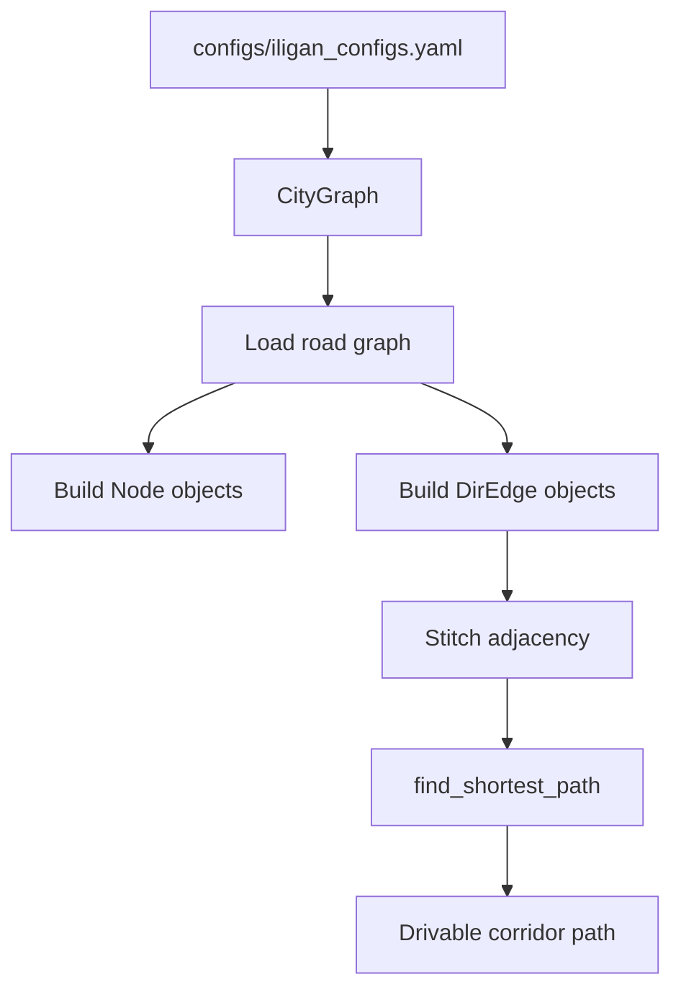
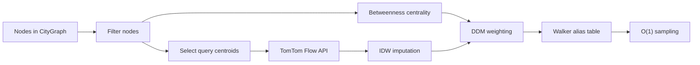
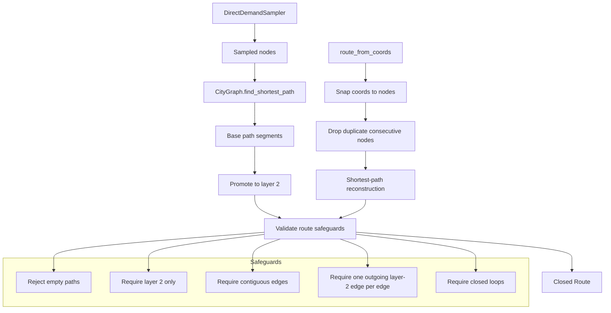
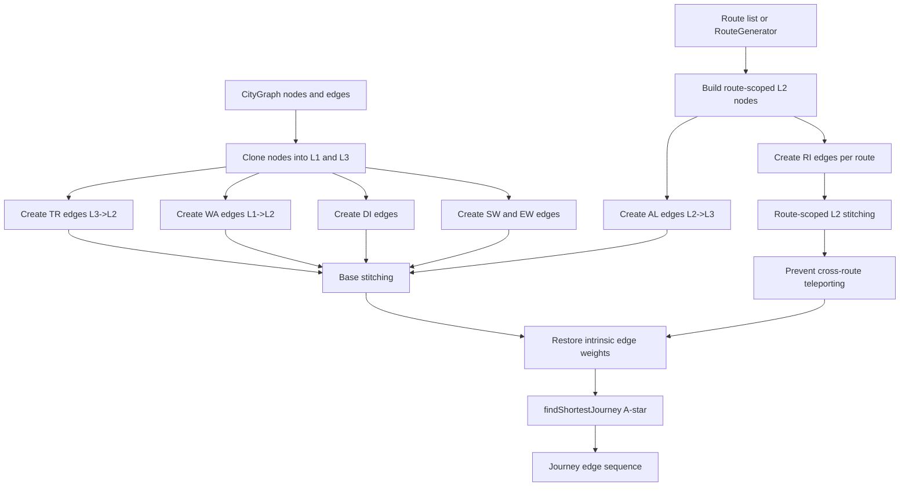

# Jeepney Route System Optimization

This README covers only:

- `utils/node.py`
- `utils/directed_edge.py`
- `utils/direct_demand_sampler.py`
- `utils/route.py`
- `utils/travel_graph.py`
- `utils/city_graph.py`
- `diagnostic.ipynb`
- `configs/iligan_configs.yaml`

It documents the actual control flow, the design rationale already recorded in the notebook and config, and the academic references that appear in those sources.

## Module notes

### `node.py`

`Node` is the atomic spatial object.

- Stores immutable `lon` and `lat`.
- Accepts optional `layer` values from `0` to `3`, or `None`.
- Rejects invalid coordinates, non-finite values, and illegal layer values.
- Generates a stable UUID-based identity.
- Draws itself onto square PIL images using a coordinate context.

The point of the class is strict state control. The graph code depends on coordinate stability, so `lon` and `lat` cannot be reassigned after construction.

### `directed_edge.py`

`DirEdge` represents a directed connection between two `Node` objects.

- Validates that endpoints exist and are not identical.
- Enforces layer-compatible geometry.
- Computes length with a haversine distance helper.
- Classifies edges by layer transition:
  - `start_walk`
  - `wait`
  - `ride`
  - `alight`
  - `transfer`
  - `end_walk`
  - `direct`
- Draws itself on square PIL images.
- Exposes `_connect()` and `_stitch()` helpers for internal graph wiring.

This file is the topology guardrail. If a route violates its layer logic here, every downstream module inherits garbage.

`_stitch()` deserves an explicit note: it builds adjacency links by matching an edge's terminal node to the next edge's starting node on the same coordinate-layer tuple. That is the fast, deterministic bridge between raw edge lists and a traversable graph.

### `city_graph.py`

`CityGraph` builds the street network and shortest-path layer.

- Loads a road graph from a PBF file or Overpass API.
- Caches the binary graph for repeat runs.
- Converts OSM nodes into `Node` objects.
- Converts arterial road segments into paired `DirEdge` objects.
- Filters drivable edges using highway tags for arterial classes only.
- Stitches edges into adjacency chains.
- Computes shortest paths with an A*-style search that only expands drivable edges.
- Supports landmark snapping and bounding-box drawing.
- Supports `inject_toy_data()` for synthetic test graphs.

Reasoning:

- Transit design on an unpruned road graph explodes combinatorially.
- Jeepneys operate as corridor services, not arbitrary point-to-point taxis.
- The arterial skeleton is the correct search space for route generation.



### `direct_demand_sampler.py`

`DirectDemandSampler` turns sparse traffic observations into a sampling distribution over nodes.

Main pieces:

- `DDMConfig` stores the model constants and sample-size parameters.
- `TrafficClient` isolates TomTom API calls and cache handling.
- `DirectDemandSampler` computes the final node sampler.

Pipeline:

1. Filter the usable nodes.
2. Compute a Cochran sample size for API calls.
3. Select query centroids.
4. Pull empirical TomTom flow weights.
5. Impute missing nodes with inverse distance weighting.
6. Blend traffic and centrality with the Direct Demand Model.
7. Build Walker alias tables for constant-time sampling.

Core equations:

```text
n0 = (Z^2 p q) / e^2
n  = n0 / (1 + (n0 - 1) / N)

P_i ∝ W_i^alpha * C_i^beta

W_j = Σ(V_i / d_ij^p) / Σ(1 / d_ij^p)
```

The config currently uses:

- `alpha = 0.6`
- `beta = 0.4`
- `idw_power = 2.0`

That split is deliberate. The repo notes treat observed traffic as the stronger signal and structural centrality as the weaker prior.

Operational constraints:

- Requires `TOMTOM_API_KEY` in the environment.
- Caches API responses and sampler state in `utils/.cache`.
- Falls back to baseline weights only when no empirical traffic is available.



### `route.py`

`Route` is the final closed transit loop.

This file is functionally complete, but it is still being refactored into cleaner validation and construction boundaries. The current behavior is already stable enough to use.

- Rejects empty paths.
- Requires all path edges to stay on layer 2.
- Requires exactly one outgoing layer-2 edge per edge in the path.
- Rejects broken contiguity before the route is accepted.
- Requires closed loops for generated and coordinate-snapped routes.
- Deduplicates consecutive snapped nodes before path construction.
- Auto-generates a route color.

`RouteGenerator`:

- Pulls demand points from `DirectDemandSampler`.
- Uses `CityGraph.find_shortest_path()` between successive sampled nodes.
- Closes the loop back to the first node.
- Promotes the resulting path into a layer-2 route.
- Treats shortest-path output as the demo route backbone, not as a free-form path.

`route_from_coords()`:

- Snaps coordinate sequences to the nearest `CityGraph` nodes with a KDTree.
- Removes duplicate consecutive nodes.
- Rebuilds the closed route from the snapped points.

`RouteSystem` is only a drawing container for multiple routes.



### `travel_graph.py`

`TravelGraph` lifts `CityGraph` and candidate `Route` objects into a layered journey network for passenger-level trip search.

- Requires a `CityGraph` and config, plus either prebuilt `routes` or a `RouteGenerator`.
- Clones graph coordinates into layer 1 (start walk) and layer 3 (end walk) node sets.
- Builds route-scoped layer-2 nodes so ride segments remain tied to their own route.
- Constructs typed edge families:
  - `SW`: start-walk edges on layer 1.
  - `WA`: wait edges from layer 1 to route layer 2.
  - `RI`: ride edges inside route layer 2.
  - `AL`: alight edges from layer 2 to layer 3.
  - `TR`: transfer edges from layer 3 back to layer 2.
  - `EW`: end-walk edges on layer 3.
  - `DI`: direct layer-1 to layer-3 links.
- Applies generalized-cost weights from config (`walk_wt`, `ride_wt`, `wait_wt`, `transfer_wt`, `direct_wt`, `alight_wt`).
- Runs A*-style search in `findShortestJourney()` from `(lon, lat, layer 1)` to `(lon, lat, layer 3)`.
- Exposes both distance and weighted-cost summaries via `calculateJourneyDistance()` and `calculateJourneyWeight()`.
- Supports 2D rendering through `draw()` and 3D journey rendering through `create_3d()`.

The stitching logic is the critical safeguard: route layer-2 edges are stitched per route index so journeys cannot "teleport" between unrelated loops that happen to share coordinates.



### `diagnostic.ipynb`

This notebook is the reasoning log and validation harness.

It documents:

- node validation behavior
- graph initialization checks
- direct-demand sampling assumptions
- Cochran sample-size justification
- the use of TomTom traffic data

It also keeps the explanatory text that the README now condenses into stable reference prose.

### `configs/iligan_configs.yaml`

This config file is the project baseline for Iligan City.

- Sets the bounding box for the active network footprint.
- Names the landmarks used for contextual rendering.
- Stores the DDM parameters.
- Records the reasoning behind the `alpha` / `beta` split.

The comments in this file are part of the documentation. They explain why the model is constrained to the current operational area and why the demand sampler weights traffic more heavily than centrality.

## Design rationale

- The network footprint matches the active Iligan jeepney system. That keeps comparisons against the current baseline meaningful.
- Route generation uses a pruned arterial graph because the design problem is not solved on residential dead ends.
- The demand sampler uses sparse TomTom observations instead of pretending full coverage exists.
- Centrality is a structural prior, not the primary signal.
- Alias tables are used because sampling is repeated and should not be linear-time.

## References

### Formal citations present in the allowed sources

1. Iliopoulou, C., Kepaptsoglou, K., & Vlahogianni, E. I. (2019). *Metaheuristics for the transit network design problem: a review and comparative analysis*. **Public Transport, 11**(3), 487-521. https://doi.org/10.1007/s12469-019-00211-2
2. Guillen, M. D., Ishida, H., & Okamoto, N. (2013). *Is the use of informal public transport modes in developing countries habitual? An empirical study in Davao City, Philippines*. **Transport Policy, 26**, 31-42. https://doi.org/10.1016/j.tranpol.2012.12.008
3. Global Network for Popular Transportation & UNDP. (2024). *A Closer Look at Informal (Popular) Transportation: An Emerging Portrait*. United Nations Development Programme.
4. Vongpraseuth, T., et al. (2025). *Acceptance and Demand Estimation of Demand Responsive Transit (DRT) in a Least Developed Country: The Case of Paratransit*. **International Journal of Connected Transportation**.
5. Cochran, W. G. (1977). *Sampling Techniques* (3rd ed.). John Wiley & Sons.

### In-repo rationale note without a full bibliographic entry

- The Iligan config comments cite Ramos-Santiago as the justification for weighting local activity above structural centrality. The repo does not include a full bibliographic record for that citation, so it is preserved here only as an in-repo note and not expanded into a fabricated reference.
