# Jeepney Route System Optimization

OVERVIEW:

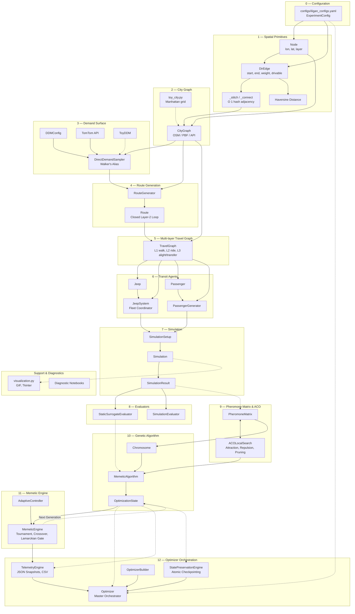
```mermaid
flowchart TD
    subgraph Layer0 [0 — Configuration]
        Config[configs/iligan_configs.yaml\nExperimentConfig]
    end

    subgraph Layer1 [1 — Spatial Primitives]
        N[Node\nlon, lat, layer]
        DE[DirEdge\nstart, end, weight, drivable]
        Stitch[_stitch / _connect\nO 1 hash adjacency]
        Hav[Haversine Distance]
        
        N --> DE
        DE --> Stitch
        DE --> Hav
    end

    Config --> N
    Config --> DE

    subgraph Layer2 [2 — City Graph]
        CG[CityGraph\nOSM / PBF / API]
        ToyC[toy_city.py\nManhattan grid]
    end

    Stitch --> CG
    N --> CG
    ToyC -.-> CG

    subgraph Layer3 [3 — Demand Surface]
        DDMCfg[DDMConfig]
        TomTom[TomTom API]
        DDS[DirectDemandSampler\nWalker's Alias]
        ToyDDM[ToyDDM]
    end

    CG --> DDS
    DDMCfg --> DDS
    TomTom --> DDS
    ToyDDM -.-> DDS

    subgraph Layer4 [4 — Route Generation]
        RG[RouteGenerator]
        Rt[Route\nClosed Layer-2 Loop]
    end

    DDS --> RG
    CG --> RG
    RG --> Rt

    subgraph Layer5 [5 — Multi-layer Travel Graph]
        TG[TravelGraph\nL1 walk, L2 ride, L3 alight/transfer]
    end

    Rt --> TG
    CG --> TG

    subgraph Layer6 [6 — Transit Agents]
        J[Jeep]
        JS[JeepSystem\nFleet Coordinator]
        P[Passenger]
        PG[PassengerGenerator]
    end

    TG --> J
    TG --> JS
    TG --> P
    TG --> PG
    J --> JS
    P --> PG

    subgraph Layer7 [7 — Simulation]
        SimSet[SimulationSetup]
        Sim[Simulation]
        SimRes[SimulationResult]
    end

    JS --> SimSet
    PG --> SimSet
    SimSet --> Sim
    Sim --> SimRes

    subgraph Layer8 [8 — Evaluators]
        SSE[StaticSurrogateEvaluator]
        SE[SimulationEvaluator]
    end

    SimRes --> SSE
    SimRes --> SE

    subgraph Layer9 [9 — Pheromone Matrix & ACO]
        PM[PheromoneMatrix]
        ACO[ACOLocalSearch\nAttraction, Repulsion, Pruning]
    end

    SimRes -.-> PM
    PM <--> ACO

    subgraph Layer10 [10 — Genetic Algorithm]
        Chr[Chromosome]
        MA[MemeticAlgorithm]
        OptState[OptimizationState]
    end

    PM --> Chr
    ACO --> MA
    Chr --> MA
    MA --> OptState
    SSE -.-> MA

    subgraph Layer11 [11 — Memetic Engine]
        Adapt[AdaptiveController]
        ME[MemeticEngine\nTournament, Crossover, Lamarckian Gate]
    end

    OptState --> ME
    Adapt --> ME
    ME -. "Next Generation" .-> OptState

    subgraph Layer12 [12 — Optimizer Orchestration]
        SPE[StatePreservationEngine\nAtomic Checkpointing]
        TE[TelemetryEngine\nJSON Snapshots, CSV]
        OB[OptimizerBuilder]
        Opt[Optimizer\nMaster Orchestrator]
    end

    ME --> TE
    OptState -.-> Opt
    OptState -.-> TE
    OptState -.-> SPE
    Config -.-> Opt
    SPE --> Opt
    TE --> Opt
    OB --> Opt

    subgraph Support [Support & Diagnostics]
        Viz[visualization.py\nGIF, Tkinter]
        Diag[Diagnostic Notebooks]
    end

    Sim -.-> Viz
```

This README covers:

- `utils/node.py`
- `utils/directed_edge.py`
- `utils/direct_demand_sampler.py`
- `utils/route.py`
- `utils/travel_graph.py`
- `utils/city_graph.py`
- `utils/jeep.py`
- `utils/jeep_system.py`
- `utils/passenger.py`
- `utils/passenger_generator.py`
- `utils/simulation.py`
- `utils/visualization.py`
- `utils/pheromone.py`
- `utils/local_search.py`
- `utils/genetic.py`
- `utils/optimizer_config.py`
- `utils/optimizer_adaptive.py`
- `utils/optimizer_telemetry.py`
- `utils/optimizer_orchestrator_io.py`
- `utils/optimizer_engine.py`
- `utils/optimizer.py`
- `diagnostic_core.ipynb`
- `diagnostic_sim.ipynb`
- `diagnostic_mutation.ipynb`
- `diagnostic_optimization.ipynb`
- `configs/iligan_configs.yaml`

## Module notes

### `node.py`

`Node` is the immutable spatial atom used everywhere else.

- Holds a stable `lon`, `lat`, and optional `layer`.
- Gives the graph code a fixed coordinate identity to stitch against.

Errors:

- Raises on invalid longitude, latitude, or layer values.

### `directed_edge.py`

`DirEdge` turns two nodes into a directional graph step.

- Encodes legal movement between layers.
- Computes edge length.
- Powers the low-level stitching used by route and journey builders.

Errors:

- Raises when endpoints are missing, identical, or layer-incompatible.

### `city_graph.py`

`CityGraph` builds the drivable street backbone from OSM data.

- Loads and caches the road network.
- Converts usable street segments into `Node` and `DirEdge` objects.
- Finds shortest drivable corridors for route generation.

Why it matters:

- It narrows the design problem to the corridor network jeepneys can actually serve.
- It is the source graph for route generation and demand sampling.

Errors:

- Raises on invalid bounding boxes.
- Raises if toy data is injected into an already populated graph.
- Raises when the start and end nodes are not part of the graph or no path exists.

**Example outputs:**

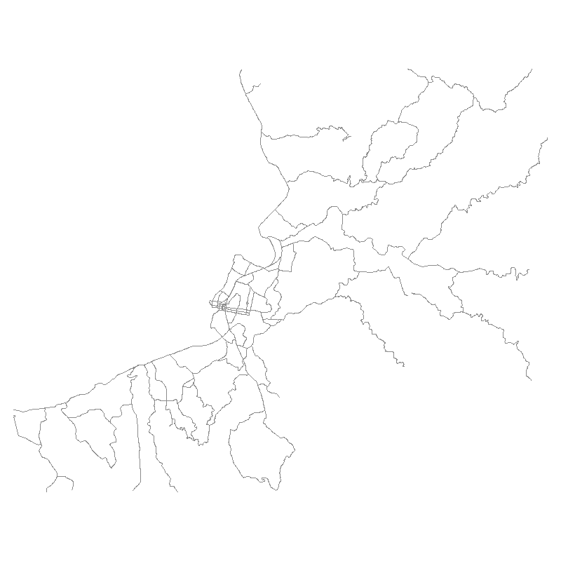

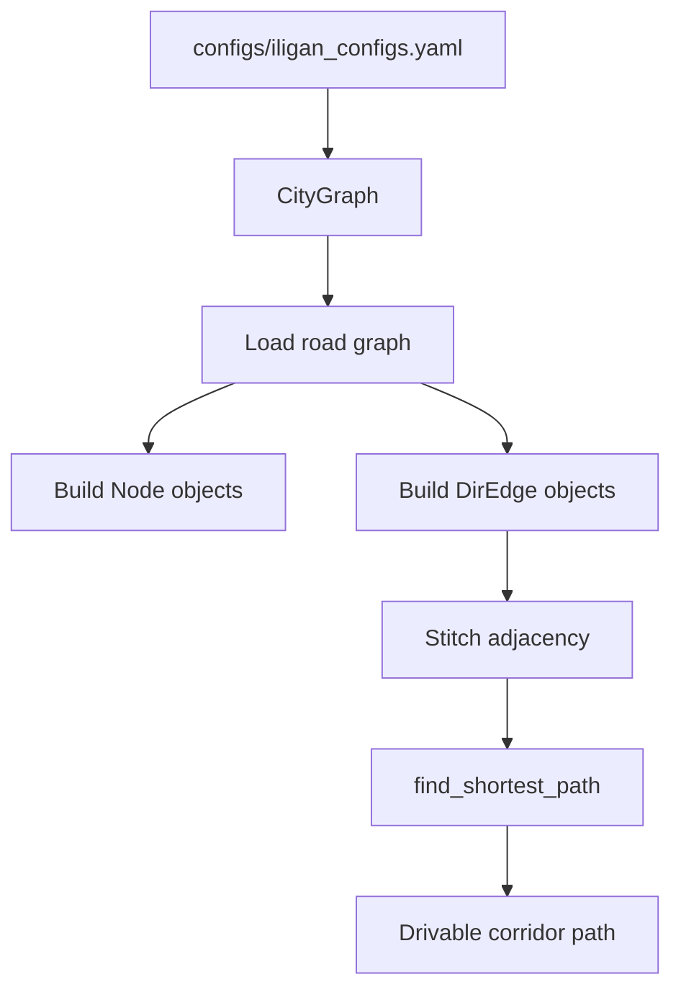
```mermaid
flowchart TD
    A[configs/iligan_configs.yaml] --> B[CityGraph]
    B --> C[Load road graph]
    C --> D[Build Node objects]
    C --> E[Build DirEdge objects]
    E --> F[Stitch adjacency]
    F --> G[find_shortest_path]
    G --> H[Drivable corridor path]
```

### `direct_demand_sampler.py`

`DirectDemandSampler` turns sparse traffic observations into node sampling.

- Blends TomTom flow data with structural centrality.
- Uses IDW to fill gaps where traffic data is missing.
- Builds alias tables for constant-time sampling.

Why it matters:

- It feeds route generation and passenger spawning with realistic origins and destinations.
- It avoids pretending the network has complete demand coverage.

Errors:

- Raises when `TOMTOM_API_KEY` is missing.
- Raises when there are no valid or drivable nodes to sample.
- Raises when cached sampler state does not match the current city graph.
- Raises when the final DDM probability mass is zero.

**Example outputs:**

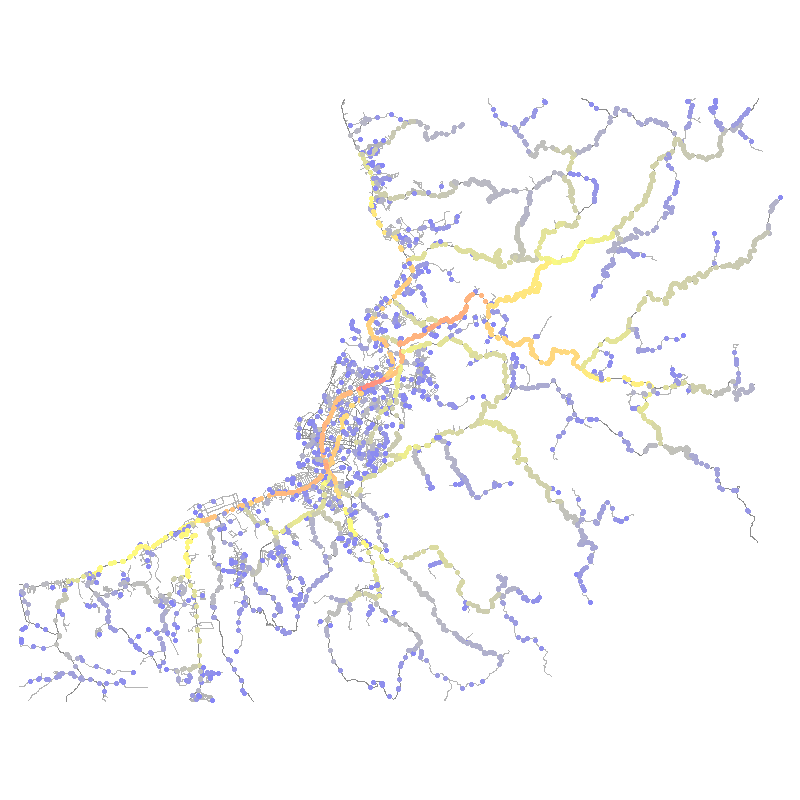
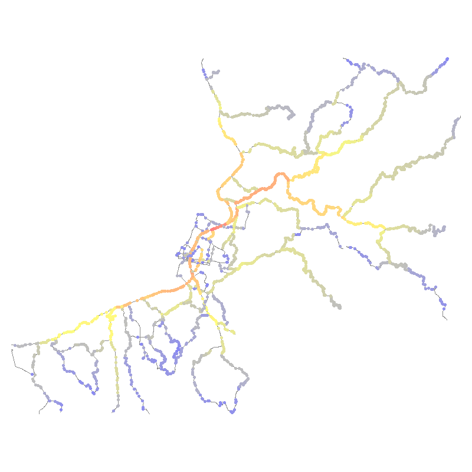

The current config keeps `alpha = 0.6`, `beta = 0.4`, and `idw_power = 2.0`, so traffic stays the stronger signal.

### `route.py`

`Route` is the closed layer-2 loop that represents a jeepney line.

- Rejects broken or non-layer-2 paths.
- Keeps routes contiguous and closed.
- Serves as the backbone for both `TravelGraph` and `JeepSystem`.

`RouteGenerator`:

- Samples demand points from `DirectDemandSampler`.
- Uses `CityGraph.find_shortest_path()` to link them.
- Converts the result into a closed route.

`route_from_coords()`:

- Snaps coordinates back to graph nodes.
- Removes duplicate consecutive nodes before rebuilding the route.

Why it matters:

- It produces the actual route objects that downstream journey planning and simulation consume.

Errors:

- Raises on empty, non-`DirEdge`, broken, branching, or non-closed paths.
- Raises when route generation cannot find a drivable path or the coordinates collapse to one node.

**Example output:**

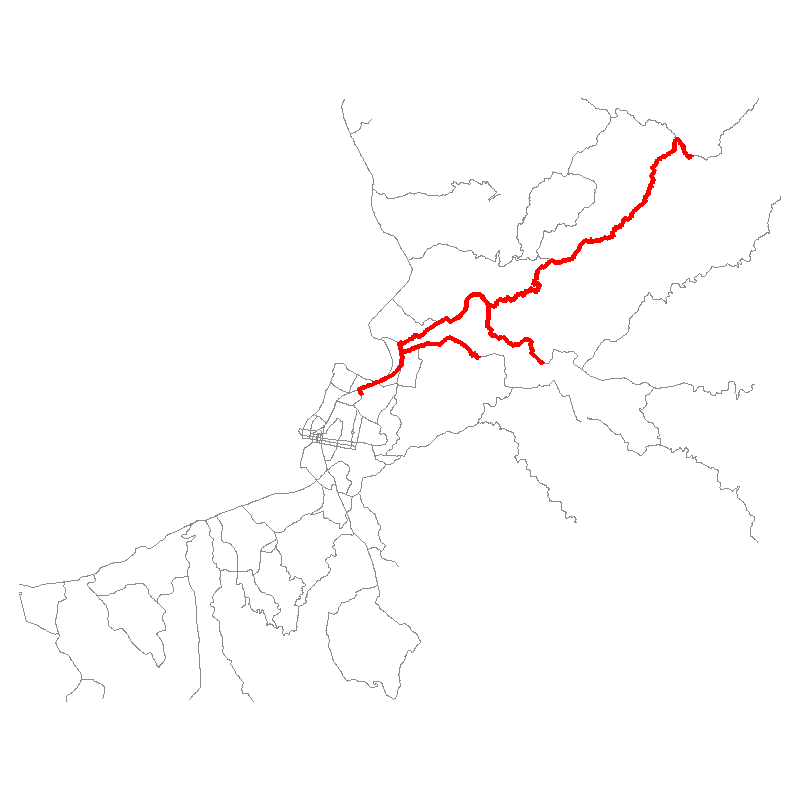

### `travel_graph.py`

`TravelGraph` lifts routes into a passenger journey graph.

- Creates walking, waiting, riding, alighting, transfer, and direct edges.
- Keeps ride edges scoped to the correct route.
- Solves passenger trips with weighted shortest-path search.

Why it matters:

- It is the layer that turns origin-destination pairs into full journeys for passengers.
- It is the bridge between route design and simulation behavior.

Errors:

- Raises when the city graph or config is missing.
- Raises when neither routes nor a route generator is provided.
- Raises when route generation fails.
- Raises when snap layers are invalid or journey endpoints are missing.

**Example outputs:**

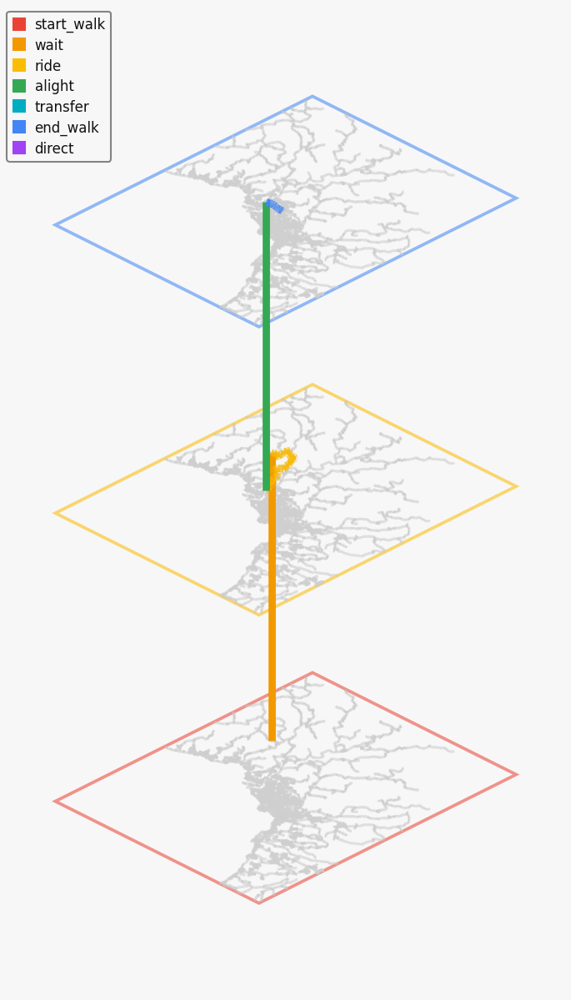
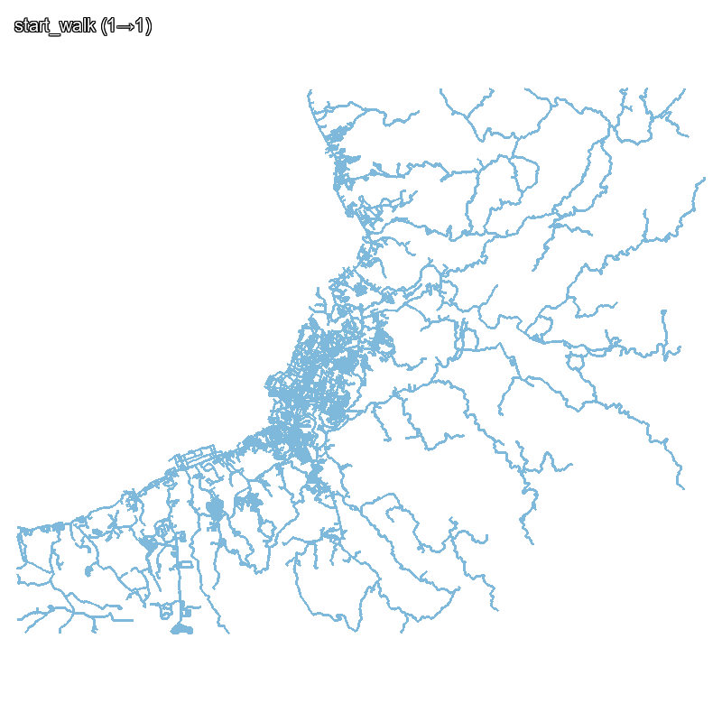

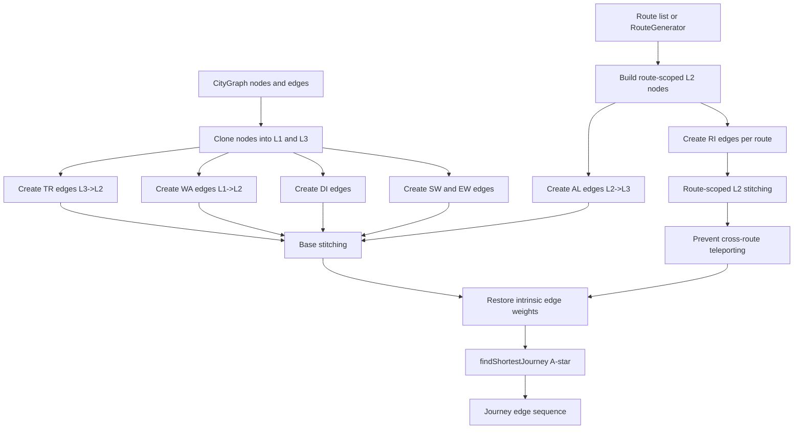
```mermaid
flowchart TD
    A[CityGraph nodes and edges] --> B[Clone nodes into L1 and L3]
    C[Route list or RouteGenerator] --> D[Build route-scoped L2 nodes]

    B --> E[Create SW and EW edges]
    B --> F[Create DI edges]
    D --> G[Create RI edges per route]
    B --> H[Create WA edges L1->L2]
    D --> I[Create AL edges L2->L3]
    B --> J[Create TR edges L3->L2]

    E --> K[Base stitching]
    F --> K
    H --> K
    I --> K
    J --> K

    G --> L[Route-scoped L2 stitching]
    L --> M[Prevent cross-route teleporting]

    K --> N[Restore intrinsic edge weights]
    M --> N
    N --> O[findShortestJourney A-star]
    O --> P[Journey edge sequence]
```

### `jeep.py`

`Jeep` is the moving vehicle that follows a route and carries passengers.

- Advances along the route one tick at a time.
- Tracks heading, position, and passenger count.
- Returns the traversed nodes so `JeepSystem` can handle boarding and alighting.

Why it matters:

- It is the live vehicle actor used in the simulation and the visualizer.

Errors:

- Raises when the route is invalid, the speed is negative, or the current position is malformed.
- `return_path_from()` returns an empty list if the requested nodes are not on the route.

**Example output:**

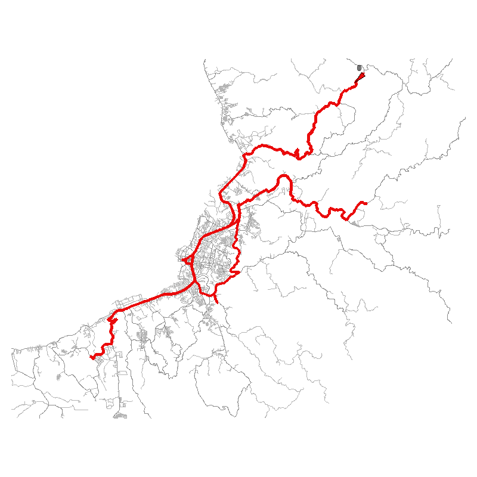

### `jeep_system.py`

`JeepSystem` coordinates the fleet and passenger interactions.

- Spreads jeeps across routes.
- Handles boarding and alighting at matching nodes.
- Lets a passenger board an alternate jeep only when the route weight stays within tolerance.

Why it matters:

- It is the operational layer that turns static routes into service behavior.
- It decides when a passenger actually boards, rides, and gets dropped off.

Errors:

- Raises when the jeep list, route list, or weight tolerance is invalid.

`FleetAllocator` lives in the same file and provides the demand-based fleet split used by the larger workflow.

**Example output:**

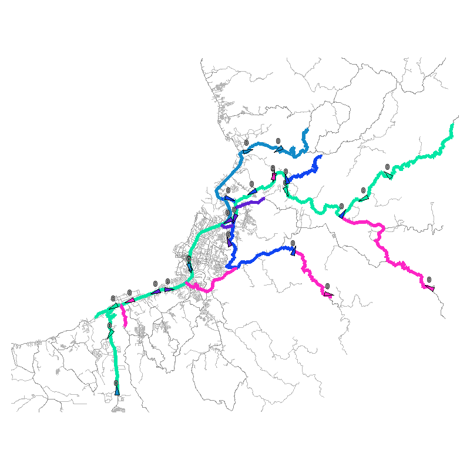

### `passenger.py`

`Passenger` is the rider state machine.

- Tracks walking, waiting, riding, and done states.
- Stores the planned journey and timing metrics.
- Exposes route and alighting queries for `JeepSystem`.

Why it matters:

- It is the object that lets the simulation measure commute time and incomplete trips.

Errors:

- Raises when the start position is malformed, speed is negative, or the journey is empty.
- Raises when coordinate setters receive non-numeric values.

### `passenger_generator.py`

`PassengerGenerator` turns the demand sampler into live passengers.

- Samples origin-destination pairs.
- Converts valid journeys into active passengers.
- Archives completed passengers for later analysis.

Why it matters:

- It is the bridge from demand modeling into the simulation loop.
- It also preserves every generated journey for later pheromone or route analysis.

Errors:

- Raises when the travel graph or sampler is missing.
- Raises when the spawn rate is negative.
- If a sampled journey cannot be found, the passenger is simply not spawned.

**Example output:**

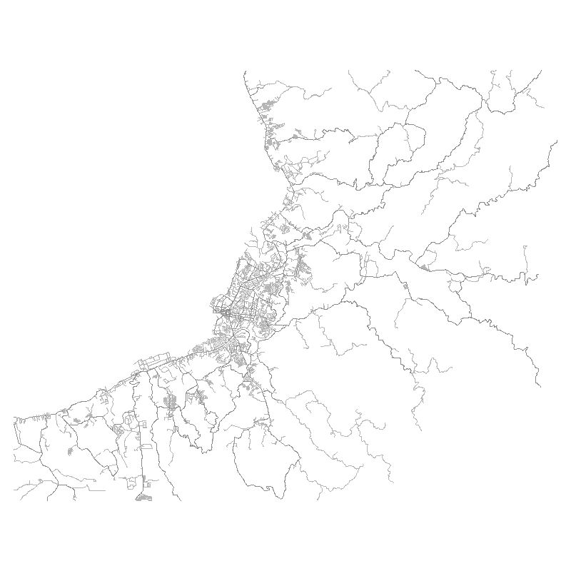

### `simulation.py`

`Simulation` runs the full system end to end.

- Builds the city graph, sampler, travel graph, fleet, and passenger generator.
- Advances the simulation tick by tick.
- Scores the run and packages the result data.
- Draws the live map and dashboard overlay.

Why it matters:

- This is the notebook-ready endpoint for understanding the system from setup to simulation output.
- If you want a thorough picture of everything up to simulation, this is the module to read alongside `diagnostic_sim.ipynb`.

Errors:

- `SimulationSetup` raises when routes are missing.
- `SimulationResult.from_file()` raises when the saved payload cannot be parsed.

**Example output:**

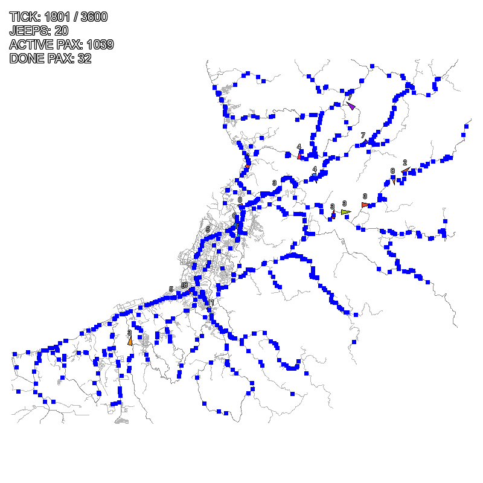

### `visualization.py`

`visualization.py` collects the reusable render helpers.

- `compile_to_gif()` turns a frame list into a GIF byte stream.
- `draw_all()` layers multiple drawables onto one base image.
- `LiveTkinterVisualizer` provides a live Tkinter playback loop.

Why it matters:

- It turns the simulation and graph objects into outputs you can show in the README, notebook, or thesis defense.

Errors:

- `compile_to_gif()` raises on empty frames, invalid frame types, non-positive FPS, or export paths outside `utils/.cache/`.

### `pheromone.py`

`PheromoneMatrix` tracks spatial network demand and passenger traffic history across the city.

- Translates passenger journeys into a continuous demand heatmap.
- Keys values by coordinate pairs (`(lon, lat)`) rather than edge object identity, ensuring consistent spatial lookups across different layers.
- Calculates dynamic Demand-Service Gaps to locate overserved and underserved corridors.

Why it matters:

- It provides the spatial intelligence for local search operators, telling the genetic algorithm exactly where routes overlap too much or where coverage is lacking.

Errors:

- Raises a `ValueError` if visualization context is missing or if rendering is requested on a non-square canvas.

**Example output:**

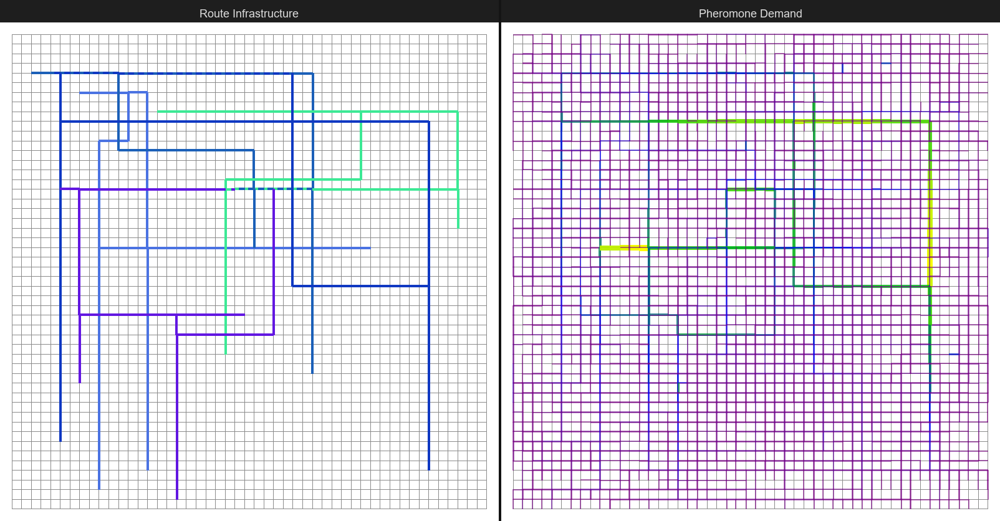

### `local_search.py`

`ACOLocalSearch` is the optimization engine that mutates routes to improve coverage, directness, and efficiency.

- Coordinates spatial route mutation strategies to continuously optimize network performance.
- Implements **Spatial Attraction** to splice detours toward underserved high-demand corridors.
- Implements **Redundancy Repulsion** to excise overlapping pathways in overserved areas.
- Implements **Tortuosity Pruning** to bypass geometric "wiggles" with straight-line shortest-path segments.

Why it matters:

- It performs the high-value spatial adaptations within the genetic algorithm, ensuring routes organically conform to city demand rather than relying on random blind walks.

Errors:

- Returns `None` if route systems or pheromones are missing, or if topological constraints (like loop contiguity) prevent a valid mutation from firing.

### `genetic.py`

`Chromosome` and `MemeticAlgorithm` implement the Phase D Lamarckian Memetic Algorithm.

- **Chromosome**: Encapsulates a candidate route system configuration, active fleet allocations, cost metrics, and an epigenetic pheromone matrix.
- **Topological Crossover**: Offspring inherit a high-density topological hub cluster from Parent A. Remaining routes are inherited from Parent B, filtered using a geometric similarity constraint to prevent duplicate overlapping loops (inspired by the Best Cost Route Crossover (BCRC) in vehicle routing, Ombuki et al., 2006).
- **Epigenetic Pheromone Inheritance**: Pheromone matrices are merged using a fitness-weighted arithmetic crossover (Michalewicz, 1992):
  $$\tau_{child}(e) = \left( \frac{f_B}{f_A + f_B} \right) \tau_A(e) + \left( \frac{f_A}{f_A + f_B} \right) \tau_B(e)$$
  where $f$ is candidate system cost. This allows offspring to directly inherit the parents' spatial demand memory (analogous to the "Belief Space" in Cultural Algorithms, Reynolds, 1994), giving the fleet allocator an immediate high-value starting point.
- **Lamarckian Mutation**: Proposal routes are mutated toward unserved demand hotspots using localized search operators (attraction, repulsion, pruning) and evaluated under the surrogate model. If cost decreases, changes are committed (Lamarckian adaptation); otherwise, they are discarded.

#### Epigenetic Memory & Blended Pheromone Maps

Below is the visualization showing how parent pheromone matrices are mathematically blended to construct the child's initial demand surface, and the corresponding semantic difference maps (Dorigo & Stützle, 2004):

| Parent A Pheromone Map | Parent B Pheromone Map | Blended Offspring Child Pheromone Map |
| :---: | :---: | :---: |
| 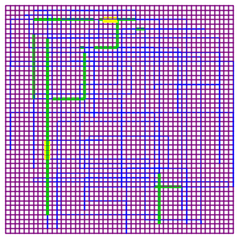 | 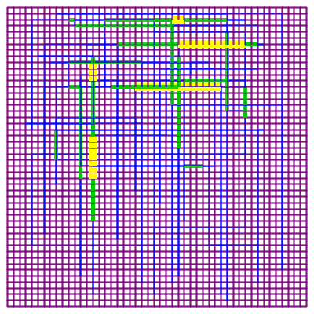 | 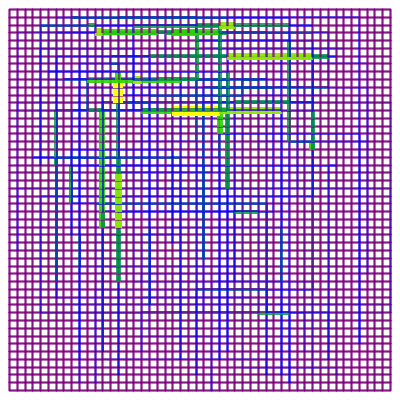 |

| Parent A vs Parent B (MSE Difference) | Parent A vs Child (MSE Difference) | Parent B vs Child (MSE Difference) |
| :---: | :---: | :---: |
| 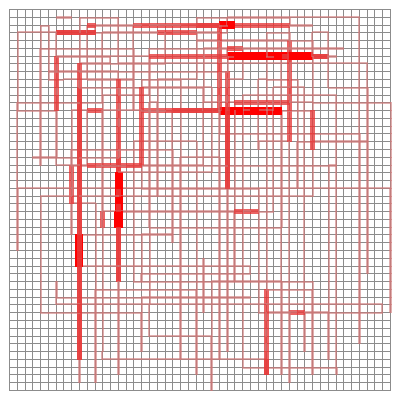 | 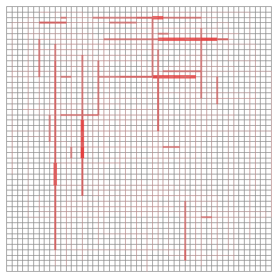 | 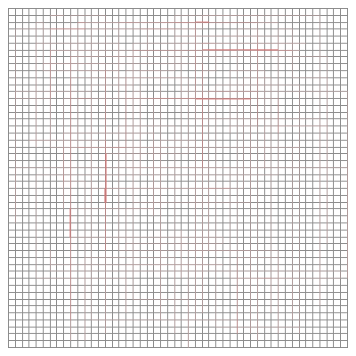 |

#### Topological Crossover Hub Layouts

Below is the spatial showcase illustrating how the top 10% highest-intensity edges forming the parent topological hubs (Eiter & Mannila, 1994) are preserved and combined to form the offspring child's hub configuration:

| Parent A Topological Hub | Parent B Topological Hub | Offspring Child Topological Hub |
| :---: | :---: | :---: |
| 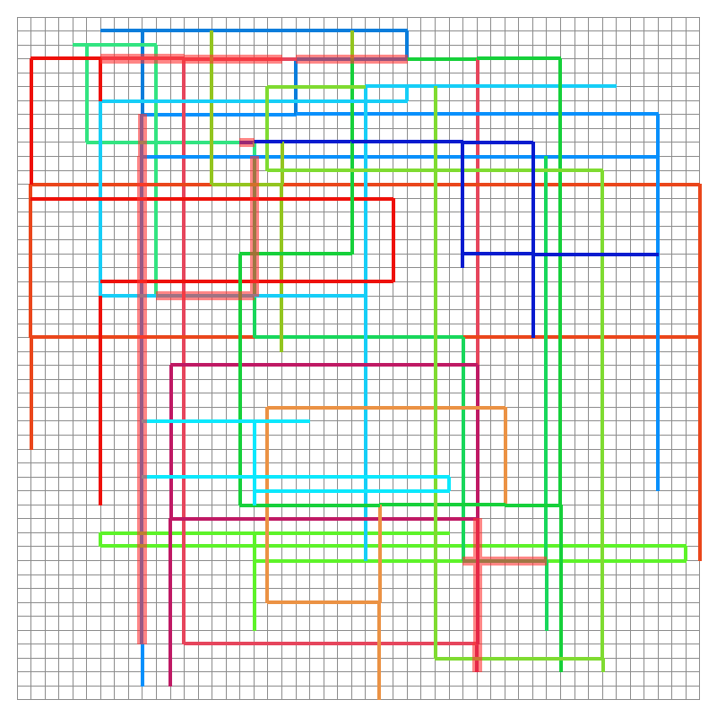 | 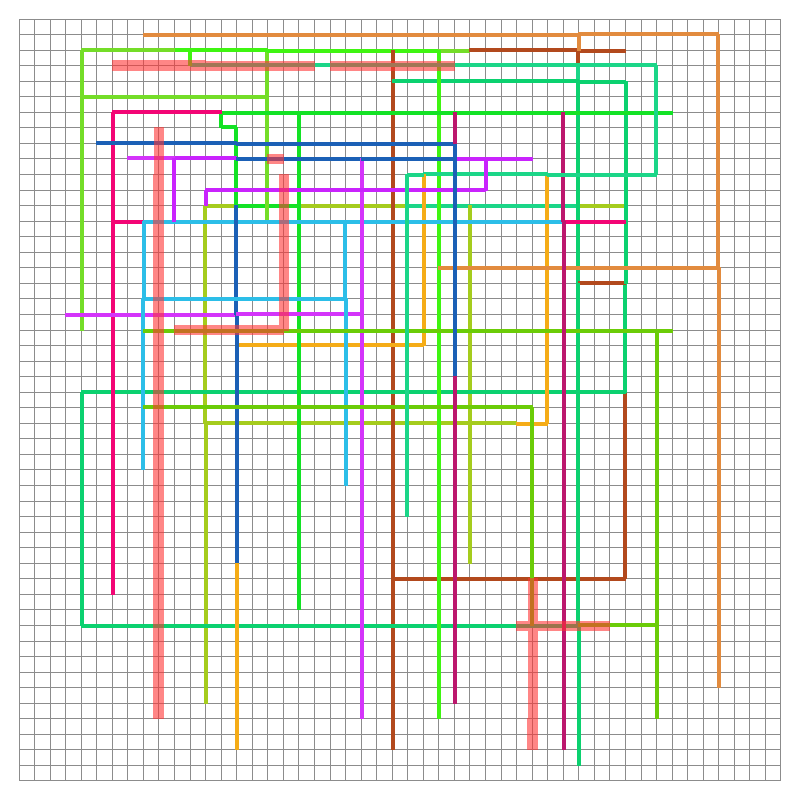 | 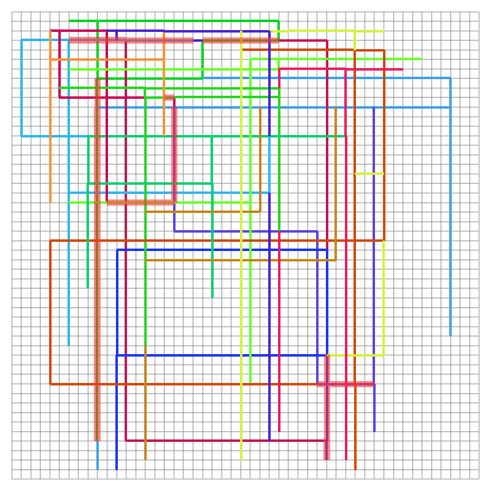 |

Errors:

- Raises `ValueError` on missing or empty parent systems, negative fleet sizes, or unconfigured CityGraph engines.

### `optimizer_config.py`

`ExperimentConfig` and `OptimizationState` manage the parameters and live execution state of the optimization run.

- **ExperimentConfig**: An immutable dataclass containing all GA hyperparameters, cost weights, simulation constraints, and travel graph penalty weights loaded from YAML.
- **OptimizationState**: Tracks active generations, stagnation counter values, global best fitness, population list, and the master pheromone matrix.

Errors:

- Raises exceptions on missing configuration attributes or malformed bounding box formats.

### `optimizer_adaptive.py`

`AdaptiveController` dynamically scales mutation probabilities using stagnation metrics to assist search loops in escaping local optima.

- **Dynamic Parameter Control**: Monitors generation stagnation. If progress slows, mutation rate scales quadratically toward a hard cap of `0.8` to force exploration (Eiben et al., 1999).
- **Exploitation Reset**: Instantly resets the mutation probability to baseline once a new best system cost is registered, returning the algorithm to localized soft-body exploitation.

### `optimizer_telemetry.py`

`TelemetryEngine` maintains execution records, genealogies, and network state snapshots.

- Logs generational fitness parameters (best cost, average cost, stagnation) to `history.csv`.
- Syncs ancestor-offspring relationships and UIDs to `lineage.csv`.
- Exports high-fidelity, client-ready JSON files containing routes geometry, pheromone intensity coordinates, and high-demand chokepoints for GIS clients.

### `optimizer_orchestrator_io.py`

`StatePreservationEngine` and `OptimizerBuilder` coordinate run serialization and setup.

- **StatePreservationEngine**: Saves generational progress using an atomic write pattern (writing to `.tmp` before renaming), protecting checkpoint pickle files from corruption on forced exits.
- **OptimizerBuilder**: Copies YAML files to new timestamped run folders for exact replication and loads past runs.

### `optimizer_engine.py`

`MemeticEngine` coordinates the evolutionary optimization pipeline.

- Generates initial decoupled populations, applies tournament selection, preserves elite chromosomes, triggers crossover operations, and manages mutation step calls.

### `optimizer.py`

`Optimizer` is the main, user-facing coordinator for the entire evolutionary search loop.

- **OSM & Synthetic Routing**: Seamlessly handles OSM real-city graphs and toy grid configurations, building demand samplers, preservation engines, and visual overlays.
- **Surrogate-Guided Search**: Bypasses the expensive full agent-based simulation by executing evaluations using the `StaticSurrogateEvaluator`.
- **Mohring & Ceder Resource Balancing**: The evaluation pipeline allocates vehicle frequencies according to the Mohring effect (Mohring, 1972; Ceder, 2007) via square root scaling:
  $$F_i = F_{total} \times \frac{\sqrt{\tau_i}}{\sum \sqrt{\tau}}$$
  where $\tau_i$ is the route's accumulated pheromone density. This mathematically balances operating costs against passenger waiting times.
- **Unified Custom Evaluate Gate**: Overrides evolutionary evaluations to perform generational pheromone evaporation ($\rho$) and deposition ($Q / C(\pi_p)$) along candidate corridors, and recalculates unserved demand gaps to guide subsequent local mutations.
- **Fail-Safe Interrupt Handlers**: Catches manual KeyboardInterrupt calls, gracefully halting execution and saving serialized state checkpoints atomically.

#### The Generational Memetic Lamarckian Loop

The diagram below outlines the main execution pipeline, tracing tournament selection, crossover, arithmetic pheromone blending, surrogate evaluation, local search mutation, and the Lamarckian gate filter:

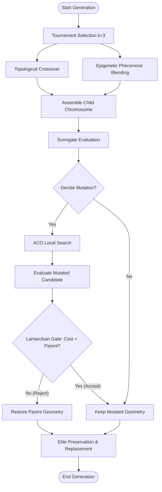
```mermaid
flowchart TD
    Start([Start Generation]) --> Select[Tournament Selection k=3]
    Select --> Crossover[Topological Crossover]
    Select --> PheroInherit[Epigenetic Pheromone Blending]
    Crossover & PheroInherit --> BuildChild[Assemble Child Chromosome]
    BuildChild --> EvalSurr[Surrogate Evaluation]
    EvalSurr --> DecideMut{Decide Mutation?}
    DecideMut -- Yes --> LocalSearch[ACO Local Search]
    LocalSearch --> EvalMut[Evaluate Mutated Candidate]
    EvalMut --> LamarckGate{Lamarckian Gate: Cost < Parent?}
    LamarckGate -- Yes (Accept) --> SaveChild[Keep Mutated Geometry]
    LamarckGate -- No (Reject) --> RestoreChild[Restore Parent Geometry]
    DecideMut -- No --> SaveChild
    RestoreChild & SaveChild --> ElitePreserve[Elite Preservation & Replacement]
    ElitePreserve --> EndGen([End Generation])
```

#### The Telemetry & State Preservation Pipeline

The flowchart below traces how active optimization states are saved via atomic file operations, lineage CSV lists are appended, and high-fidelity JSON snapshot payloads are generated:

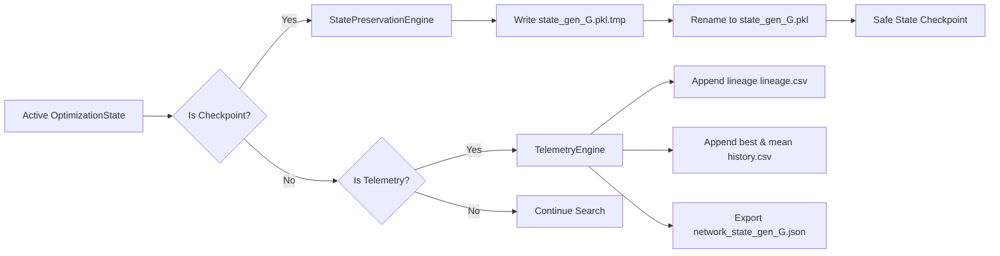
```mermaid
flowchart LR
    State[Active OptimizationState] --> Checkpoint{Is Checkpoint?}
    Checkpoint -- Yes --> Serial[StatePreservationEngine]
    Serial --> TempFile["Write state_gen_G.pkl.tmp"]
    TempFile --> AtomicReplace["Rename to state_gen_G.pkl"]
    AtomicReplace --> Saved[Safe State Checkpoint]
    Checkpoint -- No --> Telemetry{Is Telemetry?}
    Telemetry -- Yes --> Logging[TelemetryEngine]
    Logging --> Lineage["Append lineage lineage.csv"]
    Logging --> History["Append best & mean history.csv"]
    Logging --> Snapshot["Export network_state_gen_G.json"]
    Telemetry -- No --> Continue[Continue Search]
```

#### Optimization Framework Maps

Below is the visual overview of the optimization system flow and the initial traffic flow demand layout:

| Optimization Loop Pipeline | Direct Demand Surface Model |
| :---: | :---: |
| 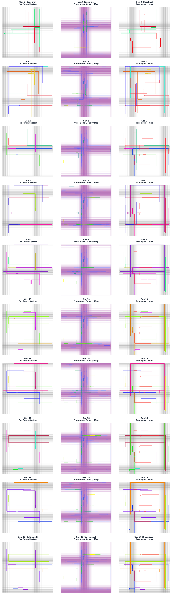 |  |

### `diagnostic_core.ipynb`

This notebook is the reasoning log and validation harness for the core spatial modules.

- Documents node validation behavior.
- Shows graph initialization checks.
- Explains direct-demand sampling assumptions and TomTom usage.

### `diagnostic_sim.ipynb`

This notebook extends the core workflow into the simulation stack.

- Connects route output to jeep movement, passenger spawning, and service behavior.
- Shows the live visualizer and GIF compilation flow.
- Is the best notebook if you want a full understanding of the system up to simulation.

### `diagnostic_mutation.ipynb`

This notebook serves as the reasoning log, validation harness, and high-performance visual diagnostic for the genetic optimization's local search mutation operators (`ACOLocalSearch`).

- Features an advanced, light-themed $3 \times 3$ operator showcase dashboard.
- Validates the three primary mutation operators (Spatial Attraction, Redundancy Repulsion, and Tortuosity Pruning) using targeted candidate searches that guarantee organic triggers.
- Quantifies performance shifts across baseline and mutated systems using both the static surrogate evaluator and full transit simulation runs.
- Implements prioritized drawing overlays where the mutated route is colored in bold red and drawn last on top of muted slate-gray unmutated background routes.

**Example output:**

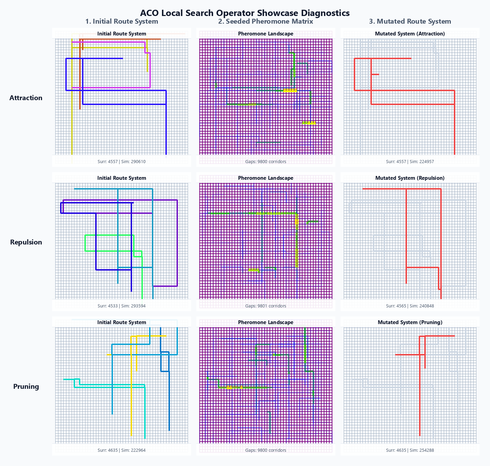

### `diagnostic_optimization.ipynb`

This notebook validates the complete unified evolutionary search loop and provides continuous high-performance visual GIS telemetry.

- Runs the end-to-end genetic optimizer under both lightweight surrogate estimations and full agent-based simulations.
- Features a Light Mode multi-row GIS visualization grid displaying the optimization progress:
  - **Column 1:** Fittest candidate route systems overlaid on the city street grid.
  - **Column 2:** Real-time, non-uniform passenger pheromone density maps.
  - **Column 3:** Highlighted non-rectangular topological hub clusters.
- Performs final route health checking, verifying connectivity, membership, and U-turn limits.

**Example output:**

### Configuration and Parameter Files (YAML)

The optimization engine is configured using a standardized YAML file structure loaded by `ExperimentConfig` to ensure absolute mathematical reproducibility.

- **Direct Demand Surface (DDM)**: Dictates how sparse TomTom data is combined with network centrality to seed passenger origins and destinations.
- **Genetic Algorithm Params**: Sets the population sizes, max search generations, stagnation limits, crossover coefficient ($\gamma$), and mutation probabilities.
- **Local Search & Pheromone Params**: Dictates base pheromones ($\tau_{init}$), evaporation ($\rho$), deposition scale ($Q$), default fleet allocations, and regional search attraction/repulsion parameters.
- **System Cost Weighting**: Establishes alpha and beta weights to penalize vehicle headway variance and extreme passenger underservice.
- **Travel Graph Weights**: Defines wait, walk, ride, and transfer generalized-cost coefficients to power passenger pathfinding.
- **Simulation Constraints**: Configures vehicle capacity, speed limits, passenger spawn rates, dispatch timings, and dispatch equidistant spacing rules.

## Design rationale

- The network footprint matches the active Iligan jeepney system, so comparisons stay grounded.
- Route generation uses a pruned arterial graph because the design problem is not solved on residential dead ends.
- The demand sampler uses sparse TomTom observations instead of pretending full coverage exists.
- Centrality is a structural prior, not the primary signal.
- Alias tables are used because sampling is repeated and should not be linear-time.

## References

### Formal citations present in the allowed sources

1. Iliopoulou, C., Kepaptsoglou, K., & Vlahogianni, E. I. (2019). *Metaheuristics for the transit network design problem: a review and comparative analysis*. **Public Transport, 11**(3), 487-521. https://doi.org/10.1007/s12469-019-00211-2
2. Guillen, M. D., Ishida, H., & Okamoto, N. (2013). *Is the use of informal public transport modes in developing countries habitual? An empirical study in Davao City, Philippines*. **Transport Policy, 26**, 31-42. https://doi.org/10.1016/j.tranpol.2012.12.008
3. Global Network for Popular Transportation & UNDP. (2024). *A Closer Look at Informal (Popular) Transportation: An Emerging Portrait*. United Nations Development Programme.
4. Vongpraseuth, T., et al. (2025). *Acceptance and Demand Estimation of Demand Responsive Transit (DRT) in a Least Developed Country: The Case of Paratransit*. **International Journal of Connected Transportation**.
5. Cochran, W. G. (1977). *Sampling Techniques* (3rd ed.). John Wiley & Sons.
6. Ceder, A. (2007). *Public Transit Planning and Operation: Theory, Modeling and Practice*. Butterworth-Heinemann.
7. Mohring, H. (1972). *Optimization and Scale Economies in Urban Bus Transportation*. *The American Economic Review*, 62(4), 591-604.
8. Ombuki, B., Ross, B. J., & Hanshar, F. (2006). *Multi-Objective Genetic Algorithms for Vehicle Routing Problem with Time Windows*. *Applied Intelligence*, 24(1), 17-30.
9. Middendorf, M., Reischle, F., & Schmeck, H. (2002). *Multi-Colony Ant Algorithms: An Application to the Multi-Mode Resource-Constrained Project Scheduling Problem*. *IEEE Transactions on Evolutionary Computation*, 6(3), 300-314.
10. Reynolds, R. G. (1994). *An Introduction to Cultural Algorithms*. *Proceedings of the Third Annual Conference on Evolutionary Programming*, 131-139.
11. Michalewicz, Z. (1992). *Genetic Algorithms + Data Structures = Evolution Programs*. Springer-Verlag.
12. Eiter, T., & Mannila, H. (1994). *Computing Discrete Fréchet Distance*. Technical Report CD-TR 94/64, Technical University of Vienna.
13. Dorigo, M., & Stützle, T. (2004). *Ant Colony Optimization*. MIT Press.
14. Eiben, A. E., Hinterding, R., & Michalewicz, Z. (1999). *Parameter Control in Evolutionary Algorithms*. *IEEE Transactions on Evolutionary Computation*, 3(2), 124-141.

### In-repo rationale note without a full bibliographic entry

- The Iligan config comments cite Ramos-Santiago as the justification for weighting local activity above structural centrality. The repo does not include a full bibliographic record for that citation, so it is preserved here only as an in-repo note and not expanded into a fabricated reference.
