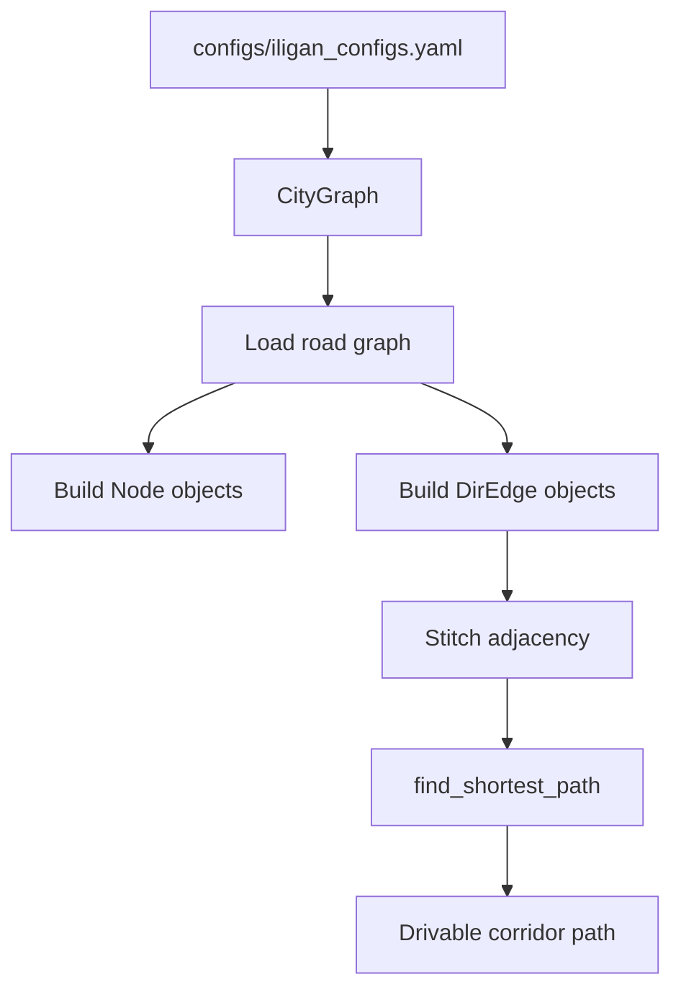
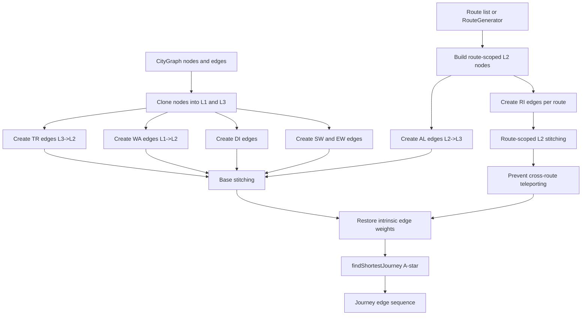

# Jeepney Route System Optimization

This README covers:

- `utils/node.py`
- `utils/directed_edge.py`
- `utils/direct_demand_sampler.py`
- `utils/route.py`
- `utils/travel_graph.py`
- `utils/city_graph.py`
- `utils/jeep.py`
- `utils/jeep_system.py`
- `utils/passenger.py`
- `utils/passenger_generator.py`
- `utils/simulation.py`
- `utils/visualization.py`
- `utils/pheromone.py`
- `utils/local_search.py`
- `diagnostic_core.ipynb`
- `diagnostic_sim.ipynb`
- `diagnostic_mutation.ipynb`
- `configs/iligan_configs.yaml`

## Module notes

### `node.py`

`Node` is the immutable spatial atom used everywhere else.

- Holds a stable `lon`, `lat`, and optional `layer`.
- Gives the graph code a fixed coordinate identity to stitch against.

Errors:

- Raises on invalid longitude, latitude, or layer values.

### `directed_edge.py`

`DirEdge` turns two nodes into a directional graph step.

- Encodes legal movement between layers.
- Computes edge length.
- Powers the low-level stitching used by route and journey builders.

Errors:

- Raises when endpoints are missing, identical, or layer-incompatible.

### `city_graph.py`

`CityGraph` builds the drivable street backbone from OSM data.

- Loads and caches the road network.
- Converts usable street segments into `Node` and `DirEdge` objects.
- Finds shortest drivable corridors for route generation.

Why it matters:

- It narrows the design problem to the corridor network jeepneys can actually serve.
- It is the source graph for route generation and demand sampling.

Errors:

- Raises on invalid bounding boxes.
- Raises if toy data is injected into an already populated graph.
- Raises when the start and end nodes are not part of the graph or no path exists.

**Example outputs:**

### `direct_demand_sampler.py`

`DirectDemandSampler` turns sparse traffic observations into node sampling.

- Blends TomTom flow data with structural centrality.
- Uses IDW to fill gaps where traffic data is missing.
- Builds alias tables for constant-time sampling.

Why it matters:

- It feeds route generation and passenger spawning with realistic origins and destinations.
- It avoids pretending the network has complete demand coverage.

Errors:

- Raises when `TOMTOM_API_KEY` is missing.
- Raises when there are no valid or drivable nodes to sample.
- Raises when cached sampler state does not match the current city graph.
- Raises when the final DDM probability mass is zero.

**Example outputs:**

The current config keeps `alpha = 0.6`, `beta = 0.4`, and `idw_power = 2.0`, so traffic stays the stronger signal.

### `route.py`

`Route` is the closed layer-2 loop that represents a jeepney line.

- Rejects broken or non-layer-2 paths.
- Keeps routes contiguous and closed.
- Serves as the backbone for both `TravelGraph` and `JeepSystem`.

`RouteGenerator`:

- Samples demand points from `DirectDemandSampler`.
- Uses `CityGraph.find_shortest_path()` to link them.
- Converts the result into a closed route.

`route_from_coords()`:

- Snaps coordinates back to graph nodes.
- Removes duplicate consecutive nodes before rebuilding the route.

Why it matters:

- It produces the actual route objects that downstream journey planning and simulation consume.

Errors:

- Raises on empty, non-`DirEdge`, broken, branching, or non-closed paths.
- Raises when route generation cannot find a drivable path or the coordinates collapse to one node.

**Example output:**

### `travel_graph.py`

`TravelGraph` lifts routes into a passenger journey graph.

- Creates walking, waiting, riding, alighting, transfer, and direct edges.
- Keeps ride edges scoped to the correct route.
- Solves passenger trips with weighted shortest-path search.

Why it matters:

- It is the layer that turns origin-destination pairs into full journeys for passengers.
- It is the bridge between route design and simulation behavior.

Errors:

- Raises when the city graph or config is missing.
- Raises when neither routes nor a route generator is provided.
- Raises when route generation fails.
- Raises when snap layers are invalid or journey endpoints are missing.

**Example outputs:**

### `jeep.py`

`Jeep` is the moving vehicle that follows a route and carries passengers.

- Advances along the route one tick at a time.
- Tracks heading, position, and passenger count.
- Returns the traversed nodes so `JeepSystem` can handle boarding and alighting.

Why it matters:

- It is the live vehicle actor used in the simulation and the visualizer.

Errors:

- Raises when the route is invalid, the speed is negative, or the current position is malformed.
- `return_path_from()` returns an empty list if the requested nodes are not on the route.

**Example output:**

### `jeep_system.py`

`JeepSystem` coordinates the fleet and passenger interactions.

- Spreads jeeps across routes.
- Handles boarding and alighting at matching nodes.
- Lets a passenger board an alternate jeep only when the route weight stays within tolerance.

Why it matters:

- It is the operational layer that turns static routes into service behavior.
- It decides when a passenger actually boards, rides, and gets dropped off.

Errors:

- Raises when the jeep list, route list, or weight tolerance is invalid.

`FleetAllocator` lives in the same file and provides the demand-based fleet split used by the larger workflow.

**Example output:**

### `passenger.py`

`Passenger` is the rider state machine.

- Tracks walking, waiting, riding, and done states.
- Stores the planned journey and timing metrics.
- Exposes route and alighting queries for `JeepSystem`.

Why it matters:

- It is the object that lets the simulation measure commute time and incomplete trips.

Errors:

- Raises when the start position is malformed, speed is negative, or the journey is empty.
- Raises when coordinate setters receive non-numeric values.

### `passenger_generator.py`

`PassengerGenerator` turns the demand sampler into live passengers.

- Samples origin-destination pairs.
- Converts valid journeys into active passengers.
- Archives completed passengers for later analysis.

Why it matters:

- It is the bridge from demand modeling into the simulation loop.
- It also preserves every generated journey for later pheromone or route analysis.

Errors:

- Raises when the travel graph or sampler is missing.
- Raises when the spawn rate is negative.
- If a sampled journey cannot be found, the passenger is simply not spawned.

**Example output:**

### `simulation.py`

`Simulation` runs the full system end to end.

- Builds the city graph, sampler, travel graph, fleet, and passenger generator.
- Advances the simulation tick by tick.
- Scores the run and packages the result data.
- Draws the live map and dashboard overlay.

Why it matters:

- This is the notebook-ready endpoint for understanding the system from setup to simulation output.
- If you want a thorough picture of everything up to simulation, this is the module to read alongside `diagnostic_sim.ipynb`.

Errors:

- `SimulationSetup` raises when routes are missing.
- `SimulationResult.from_file()` raises when the saved payload cannot be parsed.

**Example output:**

### `visualization.py`

`visualization.py` collects the reusable render helpers.

- `compile_to_gif()` turns a frame list into a GIF byte stream.
- `draw_all()` layers multiple drawables onto one base image.
- `LiveTkinterVisualizer` provides a live Tkinter playback loop.

Why it matters:

- It turns the simulation and graph objects into outputs you can show in the README, notebook, or thesis defense.

Errors:

- `compile_to_gif()` raises on empty frames, invalid frame types, non-positive FPS, or export paths outside `utils/.cache/`.

### `pheromone.py`

`PheromoneMatrix` tracks spatial network demand and passenger traffic history across the city.

- Translates passenger journeys into a continuous demand heatmap.
- Keys values by coordinate pairs (`(lon, lat)`) rather than edge object identity, ensuring consistent spatial lookups across different layers.
- Calculates dynamic Demand-Service Gaps to locate overserved and underserved corridors.

Why it matters:

- It provides the spatial intelligence for local search operators, telling the genetic algorithm exactly where routes overlap too much or where coverage is lacking.

Errors:

- Raises a `ValueError` if visualization context is missing or if rendering is requested on a non-square canvas.

### `local_search.py`

`ACOLocalSearch` is the optimization engine that mutates routes to improve coverage, directness, and efficiency.

- Coordinates spatial route mutation strategies to continuously optimize network performance.
- Implements **Spatial Attraction** to splice detours toward underserved high-demand corridors.
- Implements **Redundancy Repulsion** to excise overlapping pathways in overserved areas.
- Implements **Tortuosity Pruning** to bypass geometric "wiggles" with straight-line shortest-path segments.

Why it matters:

- It performs the high-value spatial adaptations within the genetic algorithm, ensuring routes organically conform to city demand rather than relying on random blind walks.

Errors:

- Returns `None` if route systems or pheromones are missing, or if topological constraints (like loop contiguity) prevent a valid mutation from firing.

### `diagnostic_core.ipynb`

This notebook is the reasoning log and validation harness for the core spatial modules.

- Documents node validation behavior.
- Shows graph initialization checks.
- Explains direct-demand sampling assumptions and TomTom usage.

### `diagnostic_sim.ipynb`

This notebook extends the core workflow into the simulation stack.

- Connects route output to jeep movement, passenger spawning, and service behavior.
- Shows the live visualizer and GIF compilation flow.
- Is the best notebook if you want a full understanding of the system up to simulation.

### `diagnostic_mutation.ipynb`

This notebook serves as the reasoning log, validation harness, and high-performance visual diagnostic for the genetic optimization's local search mutation operators (`ACOLocalSearch`).

- Features an advanced, light-themed $3 \times 3$ operator showcase dashboard.
- Validates the three primary mutation operators (Spatial Attraction, Redundancy Repulsion, and Tortuosity Pruning) using targeted candidate searches that guarantee organic triggers.
- Quantifies performance shifts across baseline and mutated systems using both the static surrogate evaluator and full transit simulation runs.
- Implements prioritized drawing overlays where the mutated route is colored in bold red and drawn last on top of muted slate-gray unmutated background routes.

### `configs/iligan_configs.yaml`

This file is the Iligan City baseline configuration.

- Fixes the city footprint and landmarks.
- Stores the DDM, travel graph weights, and simulation parameters.
- Documents why traffic is weighted more heavily than centrality.

The `travel_graph` weights are generalized-cost penalties, while the `simulation` section controls route count, fleet size, capacity, speeds, and spawn rate.

## Design rationale

- The network footprint matches the active Iligan jeepney system, so comparisons stay grounded.
- Route generation uses a pruned arterial graph because the design problem is not solved on residential dead ends.
- The demand sampler uses sparse TomTom observations instead of pretending full coverage exists.
- Centrality is a structural prior, not the primary signal.
- Alias tables are used because sampling is repeated and should not be linear-time.

## References

### Formal citations present in the allowed sources

1. Iliopoulou, C., Kepaptsoglou, K., & Vlahogianni, E. I. (2019). *Metaheuristics for the transit network design problem: a review and comparative analysis*. **Public Transport, 11**(3), 487-521. https://doi.org/10.1007/s12469-019-00211-2
2. Guillen, M. D., Ishida, H., & Okamoto, N. (2013). *Is the use of informal public transport modes in developing countries habitual? An empirical study in Davao City, Philippines*. **Transport Policy, 26**, 31-42. https://doi.org/10.1016/j.tranpol.2012.12.008
3. Global Network for Popular Transportation & UNDP. (2024). *A Closer Look at Informal (Popular) Transportation: An Emerging Portrait*. United Nations Development Programme.
4. Vongpraseuth, T., et al. (2025). *Acceptance and Demand Estimation of Demand Responsive Transit (DRT) in a Least Developed Country: The Case of Paratransit*. **International Journal of Connected Transportation**.
5. Cochran, W. G. (1977). *Sampling Techniques* (3rd ed.). John Wiley & Sons.

### In-repo rationale note without a full bibliographic entry

- The Iligan config comments cite Ramos-Santiago as the justification for weighting local activity above structural centrality. The repo does not include a full bibliographic record for that citation, so it is preserved here only as an in-repo note and not expanded into a fabricated reference.
