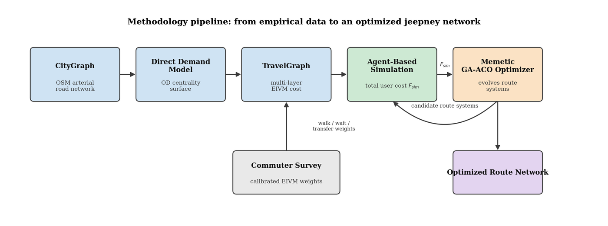
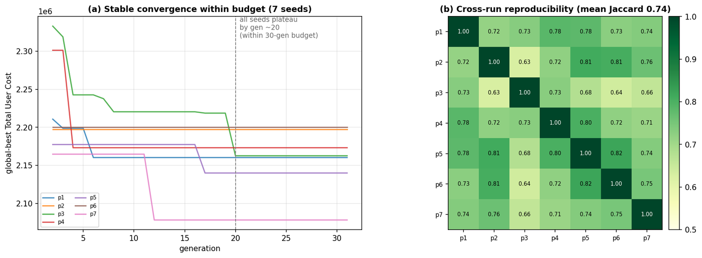
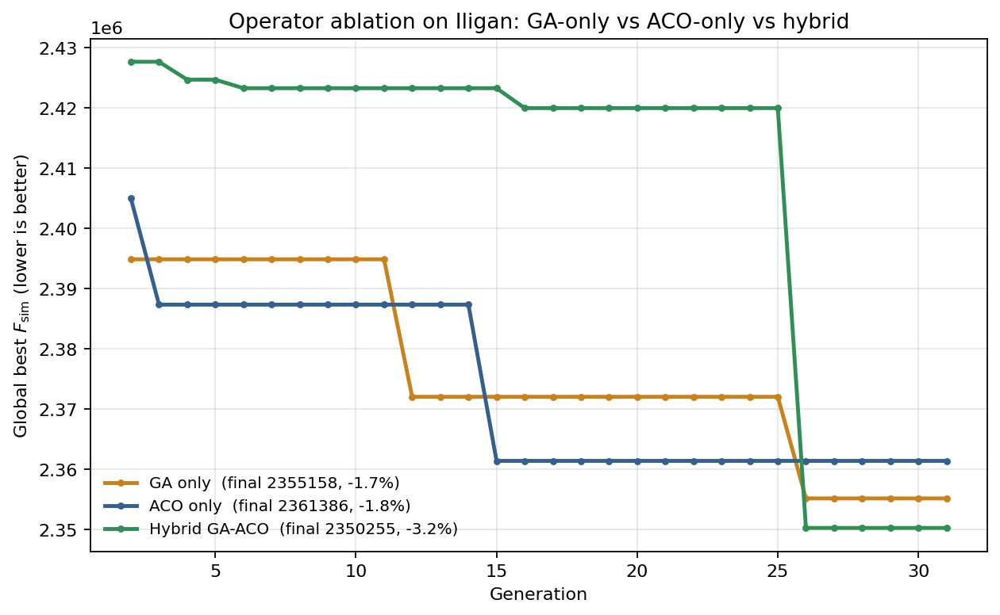
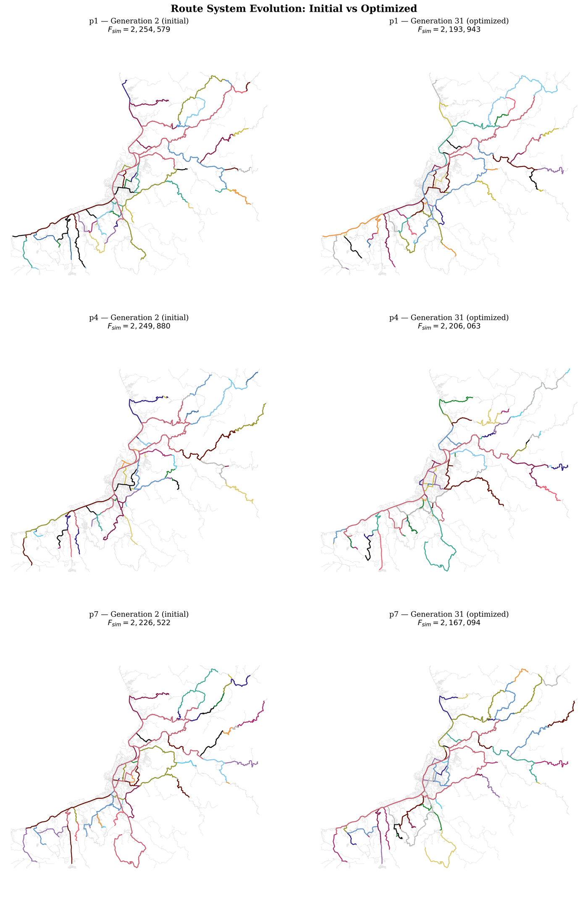
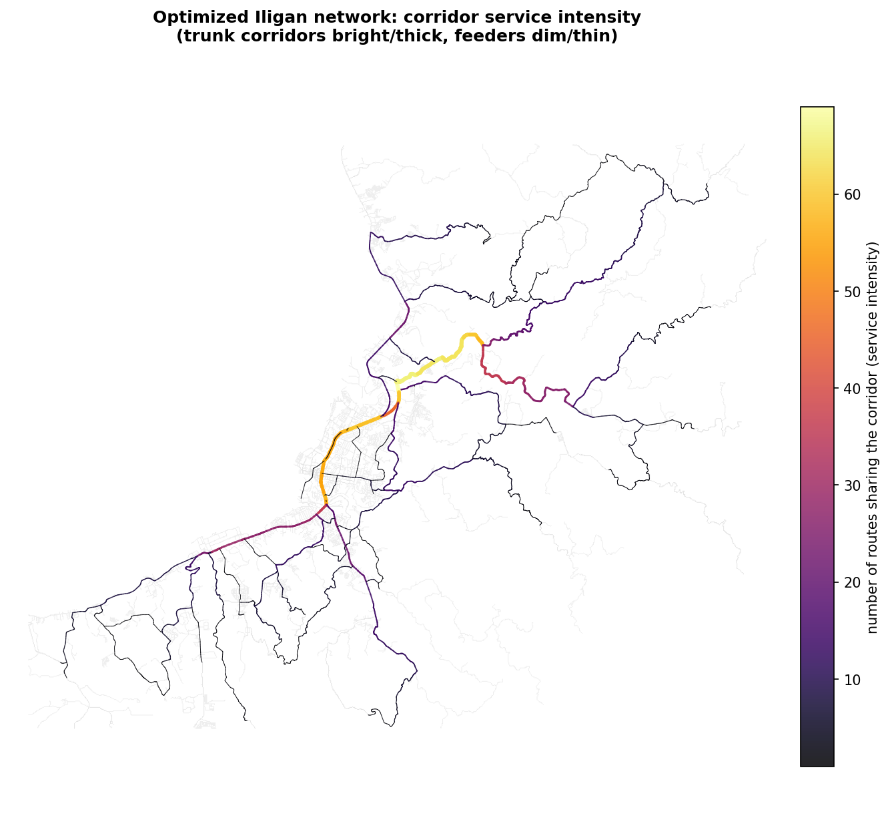
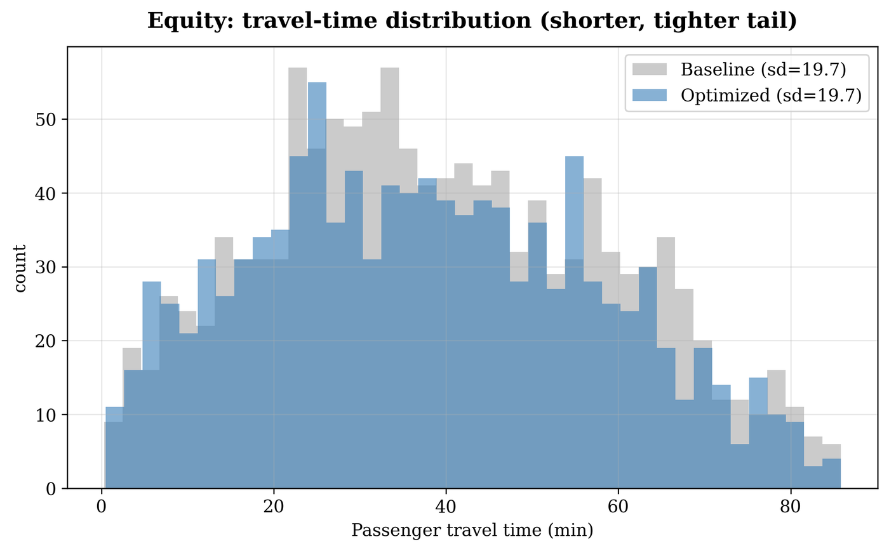
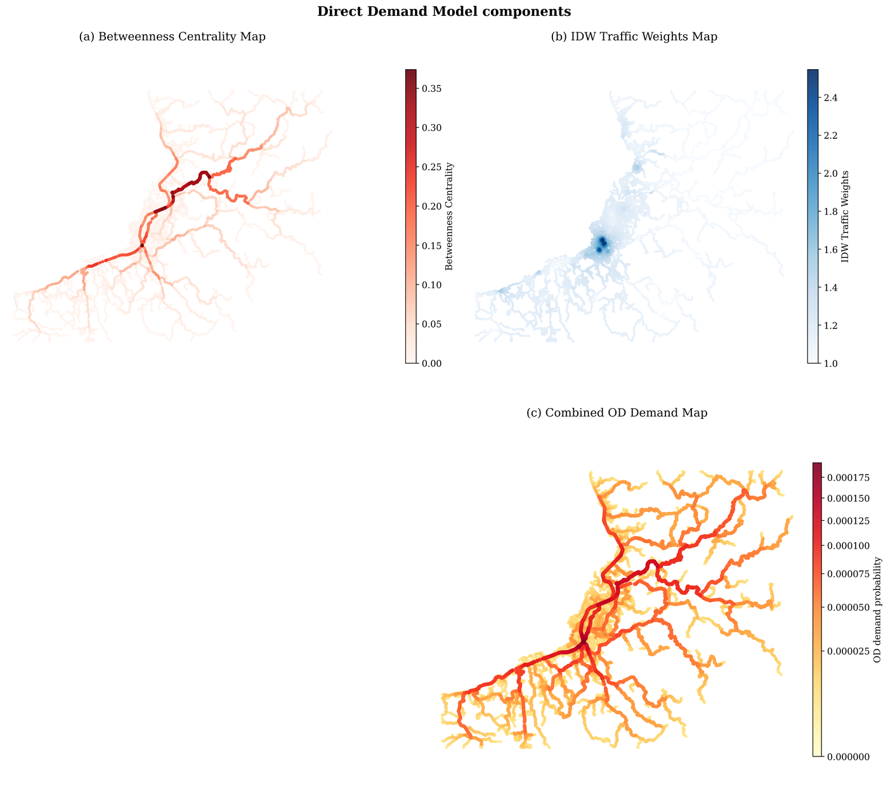
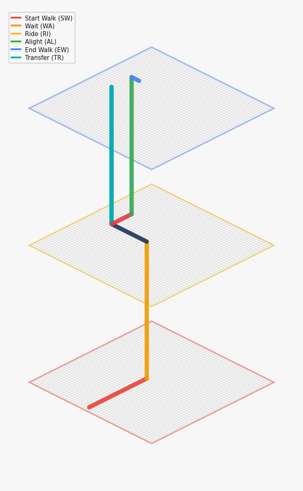
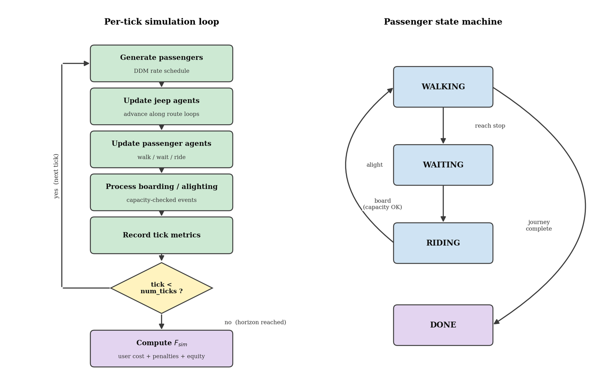
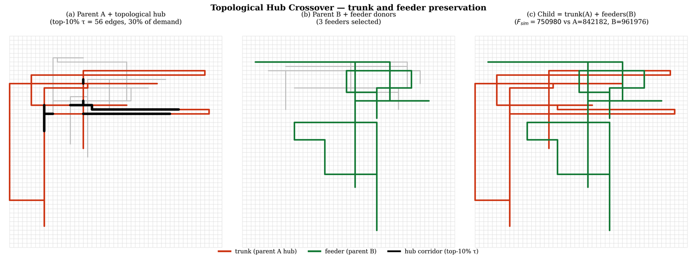

# Jeepney Route Network Optimization

A parallelized hybrid memetic algorithm that designs multi-route jeepney networks by
evolving them against an agent-based commuter simulation, applied to Iligan City,
Philippines.

Philippine jeepneys are informal paratransit: no fixed timetable, hail-and-ride boarding,
routes set by operator convention rather than by design. That breaks the assumptions
behind conventional transit optimization, which generally presumes scheduled service and
a known origin-destination matrix. This project formulates the problem as a data-driven
Transit Route Network Design Problem and solves it with a Genetic Algorithm whose local
search is an Ant Colony Optimization variant, scoring every candidate network with a
tick-by-tick simulation of individual passengers whose walking, waiting, and transfer
behavior is calibrated from a 214-respondent commuter survey.

This repository is the codebase behind an undergraduate thesis at MSU-Iligan Institute of
Technology (June 2026). It contains the framework, the configs that produced the reported
runs, and the curated result artifacts.



---

## Results

### The optimizer converges to the same network regardless of seed

Seven independent runs of the production profile (38 routes, 2000 vehicles, 30
generations) were launched under seven different random seeds. Every seed plateaued by
roughly generation 20, and the seven converged networks share a mean pairwise Jaccard
similarity of **0.74** (range 0.61 to 0.82).



That reproducibility is the headline claim, and it is deliberately stated ahead of any
cost-reduction figure. See [On the variance](#on-the-variance) for why.

### The hybrid beats either operator alone

The two mechanisms separating this from a plain genetic algorithm are the ACO pheromone
memory (inherited epigenetically by offspring) and the gap-gated Lamarckian local search.
Ablating them at full Iligan scale, under identical seeds and identical computational
budgets:

| Configuration | Start `F_sim` | Final `F_sim` | Reduction |
|---|---:|---:|---:|
| **Hybrid** (crossover + pheromone inheritance + local search) | 2,427,616 | **2,350,255** | **3.2%** |
| GA-only (crossover + random mutation) | 2,394,836 | 2,355,158 | 1.7% |
| ACO-only (single lineage + pheromone-guided local search) | 2,404,936 | 2,361,386 | 1.8% |



The trajectories say more than the endpoints. ACO-only stalls from generation 15 onward:
without recombination the single lineage runs out of local improvements. GA-only descends
steadily but modestly. Only the hybrid is still improving in the final third of the
budget, with a drop at generation 26 that carries it past both.

At toy-city scale the picture differs, and the repo ships those artifacts too
(`results/ablation_toy/`): on a six-route grid the search space is small enough that a
plain GA nearly saturates it, so GA-only and hybrid finish within evaluation variance of
each other. ACO-only stalls at both scales.

### A trunk-and-feeder hierarchy emerges without being asked for

Three of the seven seeds, at generation 2 against generation 31. The random starting
networks scatter overlapping loops across the map. The converged ones consolidate
redundant corridors into shared trunks and push the leftovers out as dedicated feeders.



Nothing in the objective function rewards hierarchy. It appears anyway. Colouring each
physical corridor by how many routes traverse it shows a small set of high-intensity
arterial trunks carrying the bulk of overlapping service, with single-route feeders
extending coverage into the periphery.



Across the seven runs the optimized networks put **82 to 90%** of demand-weighted
population within the survey-derived 864 m walking threshold of a stop, and traverse
**60 to 77%** of drivable road-network nodes.

The backbone also survives a change of demand regime. Re-optimizing against the 08:00
peak, the 13:00 off-peak, and the 17:00 peak yields arterial structures with mean pairwise
Jaccard above 0.70; what moves between regimes is feeder allocation, not the trunks.

### Equity, and where the evidence runs out

The cost function carries an equity regularizer penalizing the standard deviation of
passenger travel times. Whether it accomplishes anything measurable is a fair question,
and the honest answer is that this experiment cannot show that it does.



The optimized distribution sits marginally left of the baseline in the mid-range and
slightly under it in the 60 to 70 minute band, which is the direction the regularizer is
supposed to push. The two standard deviations come out identical at 19.7 minutes. Any tail
compression here is smaller than the simulator's evaluation noise, so this is reported as
a direction rather than an effect. Demonstrating an equity gain would need repeated seeds
per arm and a distributional test, which the thesis compute budget did not cover.

### On the variance

The objective is evaluated by a stochastic agent-based simulation whose per-evaluation
variance is roughly 12%. The gaps between the three ablation arms are 5,000 to 11,000 on
a cost around 2.35 million, which is well inside that noise band. The paper reports them
as confirming an expected *ordering* and descent behaviour, not as precise margins, and
this README follows that.

The same caution applies to the headline improvement. At optimization time the randomly
initialized generation-zero baseline averages roughly 2.36 x 10^6 Total User Cost and the
optimized solutions average roughly 2.17 x 10^6. Re-simulating the finished networks from
scratch (`results/benchmarks/`) produces distributions that overlap the random baseline,
which is exactly what a 12% per-evaluation variance predicts. Reproducible structural
convergence is the robust finding here; the cost delta is directional evidence.

---

## How it works

### The environment

**CityGraph** extracts Iligan's road network from an OpenStreetMap `.pbf` and prunes it to
the arterial subgraph that jeepneys actually operate on, since the design problem is not
solved on residential dead ends.

**DirectDemandModel** substitutes for the origin-destination matrix that does not exist
for this city. It fuses betweenness centrality (a structural prior) with sparse historical
speed observations from the TomTom API, interpolated across the network by inverse
distance weighting, then compiles the result into a Walker alias table so that repeated
passenger sampling is constant-time rather than linear.

The three panels below are the two inputs and the result: betweenness centrality, the
inverse-distance-weighted traffic surface, and the fused origin-destination demand the
simulator actually samples from.



**TravelGraph** is a three-layer construction: a walk layer, a ride layer, and an
alight/transfer layer, connected by typed inter-layer edges. The layering is what prevents
a passenger from teleporting between routes: any transfer must be paid for by traversing a
real walk edge, at a cost the survey calibrated. Pathfinding is A\* with an admissible
heuristic.



### The simulation

A tick-by-tick microscopic simulation (10 s per tick, 540 ticks for a 90-minute horizon)
runs a fixed per-tick order: spawn demand from the DDM rate schedule, advance vehicles
along their route loops, advance passengers through walk/wait/ride, process
capacity-checked boarding and alighting, record metrics. The order is fixed so the loop is
deterministic given a seed. Passengers are individual agents with a state machine
(walking, waiting, riding, done) and survey-calibrated parameters: an
85th-percentile willingness-to-walk of 864 m, and transfer aversion modelled as a logistic
function of in-vehicle time savings with a 15.78-minute indifference threshold. Vehicles
enforce a 16-passenger capacity, so a full jeepney passes waiting passengers by. Fleet size
per route follows Mohring's square-root rule.

The simulation returns Total User Cost: accumulated walking, waiting, in-vehicle, and
transfer time, with an equity regularizer penalizing the standard deviation of passenger
travel times.



### The optimizer

A population of route systems evolves under a Genetic Algorithm. Two things make it
memetic rather than merely genetic:

**Topological hub crossover.** Instead of splicing route lists arbitrarily, the operator
identifies each parent's topological hub (its top-decile pheromone edges), takes the trunk
structure from one parent and the feeder branches from the other, and stitches them.



**Lamarckian local search with epigenetic inheritance.** After simulation, each network
carries a realized pheromone map recording where demand actually materialized. Subtracting
served supply from that demand gives a signed demand-service gap, which drives three
operators: spatial attraction toward underserved corridors, redundancy repulsion away from
oversubscribed ones, and circuity pruning. Improvements are written back into the
chromosome, which is what makes the learning Lamarckian rather than Baldwinian. Offspring
inherit a fitness-weighted blend of both parents' pheromone maps.

Acceptance is gated on the cheap demand-service gap rather than on a fresh simulation,
which is what keeps the search affordable. An `AdaptiveController` scales mutation rate
against a stagnation counter, and convergence is declared on elite Jaccard similarity plus
population variance instead of a fixed generation count.

Candidate evaluation runs across a process pool. Each worker deserializes the 36k-node
environment once and then receives only route geometry, since re-sending the graph per
candidate would dominate the runtime.

Full module-by-module detail is in [docs/architecture.md](docs/architecture.md).

---

## Repository layout

```
jeepney/              the library
  node, directed_edge         spatial primitives
  city_graph, toy_city        real and synthetic environments
  direct_demand_sampler       the demand surface
  route, travel_graph         routes and the three-layer graph
  jeep, jeep_system           vehicle agents and the fleet coordinator
  passenger, passenger_generator
  simulation, simulation_parallel
  pheromone, local_search     ACO memory and the Lamarckian operators
  genetic, optimizer_engine   chromosomes, selection, crossover
  optimizer*                  orchestration, telemetry, checkpointing
  evaluation_metrics, post_evaluation
  pipeline.py                 convenience facade used by scripts and notebooks

scripts/
  run_optimization.py         production Iligan runs
  run_toy_optimization.py     short toy run with per-generation telemetry
  run_ablation_toy.py         three-arm operator ablation (toy)
  run_ablation_iligan.py      three-arm operator ablation (full scale, slow)
  run_scenarios.py            behavioral archetype sensitivity
  showcase_optimization.py    end-to-end visual walkthrough
  analysis/                   evaluation, benchmarking, mutator experiments
  figures/                    the paper's figure generators

configs/          profile_p1.yaml is the production Iligan profile
data/             the .pbf extract, traffic CSV, and cached environment pickles
results/          curated artifacts: benchmarks, toy ablation, calibration sweeps
notebooks/        two showcase notebooks (toy and Iligan)
tests/            smoke tests that exercise each pipeline end-to-end at tiny scale
docs/             architecture notes, ablation notes, figures
outputs/          runtime scratch, gitignored (every run writes a timestamped folder here)
```

---

## Getting started

```bash
python -m venv .venv && .venv/Scripts/activate   # Windows; use bin/activate on POSIX
pip install -r requirements.txt
```

Python 3.11 or newer. `pyrosm` is the awkward dependency: it compiles a C extension and is
only needed when building a `CityGraph` from a `.pbf`. Scripts that read the cached
environment pickles in `data/cache/` never import it.

Verify the install with the smoke tests, which run the whole pipeline at deliberately tiny
scale in seconds:

```bash
python tests/test_showcase_toy.py
```

Run everything from the repository root; relative paths in the configs assume it.

## Running things

A short toy-city optimization with per-generation telemetry, then the figures that replay
it:

```bash
python -m scripts.run_toy_optimization --routes 10 --generations 30
```

```bash
python -m scripts.figures.fig_optimization
```

The three-arm operator ablation on the toy instance:

```bash
python -m scripts.run_ablation_toy --generations 20 --population 12
```

One production Iligan run. This is a full 38-route, 2000-vehicle, 30-generation search and
takes hours:

```bash
python -m scripts.run_optimization --tag p1 --seed 1
```

The seven-seed reproducibility set, in parallel on one machine. Cap the pool with
`OPT_N_WORKERS` if RAM is tight, since each worker holds 1 to 2 GB at this problem size:

```bash
python -m scripts.run_optimization --batch p1 p2 p3 p4 p5 p6 p7
```

Then evaluate whatever finished:

```bash
python -m scripts.analysis.evaluate_runs
```

`evaluate_runs` is tolerant of partial completion and uses whichever runs exist.

## Reproducing the figures

The environment figures read the cached pickles in `data/cache/` and rebuild nothing:

```bash
python -m scripts.figures.fig_environment --list
```

The memetic mechanics figures run three toy simulations and render from them:

```bash
python -m scripts.figures.fig_memetic --only memetic_hub_crossover
```

Figure generation is split from optimization on purpose. `fig_optimization` replays a
finished run's telemetry from JSON and CSV, so figures can be restyled repeatedly without
re-running the search.

---

## Limitations

Stated plainly, because they bound what the results mean.

- **Demand is static and inelastic.** No modal shift, no induced demand, no land-use
  feedback. Commuters do not abandon jeepneys in response to a worse network.
- **No traffic microsimulation.** Travel times are calibrated from TomTom speed profiles,
  but vehicle queueing, intersection delay, and signal phasing are not modelled, so there
  is no congestion feedback loop between the optimized routes and general traffic.
- **User-side objective only.** Fuel, wages, fleet procurement, fare collection, and
  emissions are outside the cost function. This optimizes for passengers, not operators.
- **No digitized baseline to compare against.** Iligan's existing route system has no
  machine-readable record, so the reference is a stochastic generation-zero baseline
  rather than the network that exists today. Do not read the results as "X% better than
  the current jeepney routes".
- **Synthetic passenger demand.** Agent attributes are generated from statistical
  assumptions calibrated by survey, not from observed individual trips.
- **The survey skews young.** Cohort sensitivity for groups such as senior citizens is
  parameterized from literature rather than measured, so equity findings for those groups
  are modelled rather than empirical.
- **Routes are static and two-way.** No one-way restrictions, no dynamic diversion, no
  real-time dispatch.

---

## License and data attribution

The source code is MIT licensed. See [LICENSE](LICENSE).

The bundled data is not covered by that license and carries its own terms:

- `data/iligan-city.pbf` and `data/philippines-latest.osm.pbf` are extracts of
  OpenStreetMap, © OpenStreetMap contributors, available under the
  [Open Database License](https://www.openstreetmap.org/copyright) (ODbL 1.0). The cached
  `CityGraph` objects in `data/cache/` are derived from them and inherit those terms.
- `data/iligan_node_with_traffic_data.csv` holds speed observations retrieved from the
  TomTom Traffic API and is included for provenance. Redistribution of TomTom data is
  governed by their API terms, not by this repository's license.

If you reuse the network or demand artifacts, attribute OpenStreetMap and check TomTom's
current terms for the traffic component.

## Paper

**Parallel Hybrid Agent-Based Metaheuristic Optimization of Multi-Route Jeepney Networks
Using Behavioral Simulation.**
Joshua Radz T. Adlaon, Shir Keilah T. Connor, and Gio Kiefer A. Sanchez.
Supervised by Prof. Orven E. Llantos, PhD, SMIEEE.
Department of Computer Science, College of Computer Studies, MSU-Iligan Institute of
Technology. June 2026.

The manuscript is not distributed in this repository.

## Key references

The methodological load-bearing ones. The full bibliography is in the thesis.

1. Mohring, H. (1972). Optimization and Scale Economies in Urban Bus Transportation.
   *The American Economic Review*, 62(4), 591-604.
2. Ceder, A. (2007). *Public Transit Planning and Operation: Theory, Modeling and
   Practice*. Butterworth-Heinemann.
3. Iliopoulou, C., Kepaptsoglou, K., & Vlahogianni, E. I. (2019). Metaheuristics for the
   transit network design problem: a review and comparative analysis. *Public Transport*,
   11(3), 487-521.
4. Dorigo, M., & Stützle, T. (2004). *Ant Colony Optimization*. MIT Press.
5. Eiben, A. E., Hinterding, R., & Michalewicz, Z. (1999). Parameter Control in
   Evolutionary Algorithms. *IEEE Transactions on Evolutionary Computation*, 3(2),
   124-141.
6. Guillen, M. D., Ishida, H., & Okamoto, N. (2013). Is the use of informal public
   transport modes in developing countries habitual? An empirical study in Davao City,
   Philippines. *Transport Policy*, 26, 31-42.
